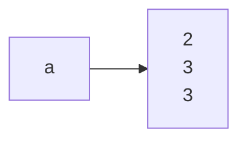
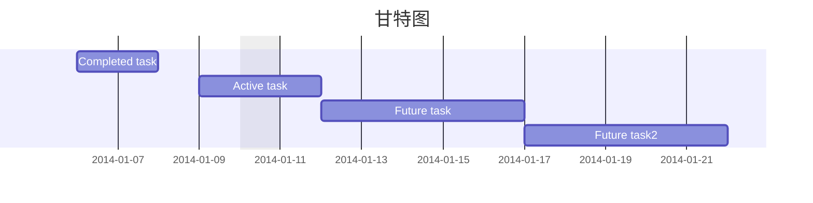
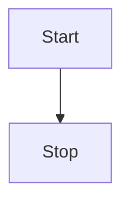
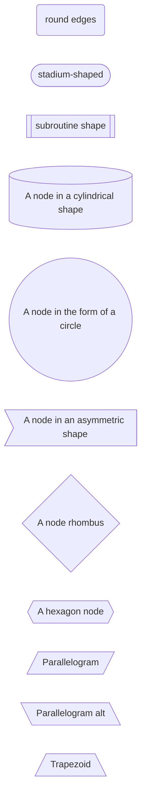
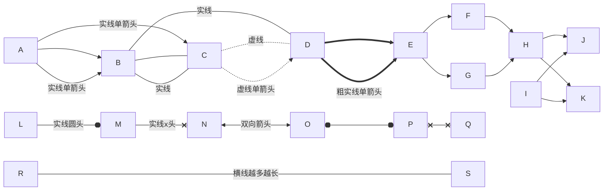
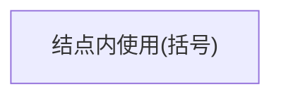
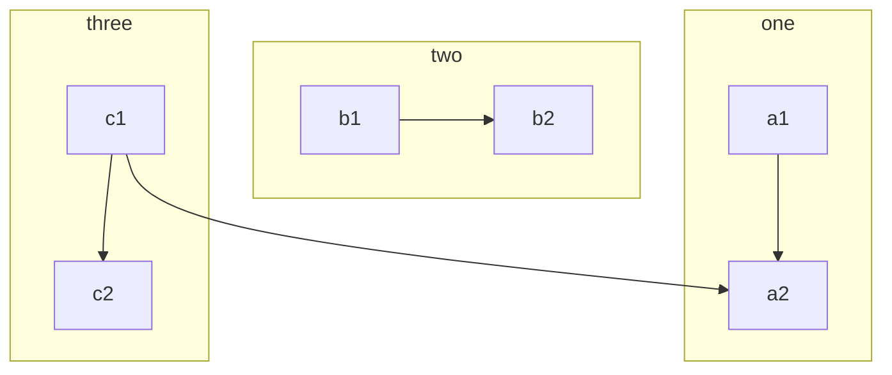
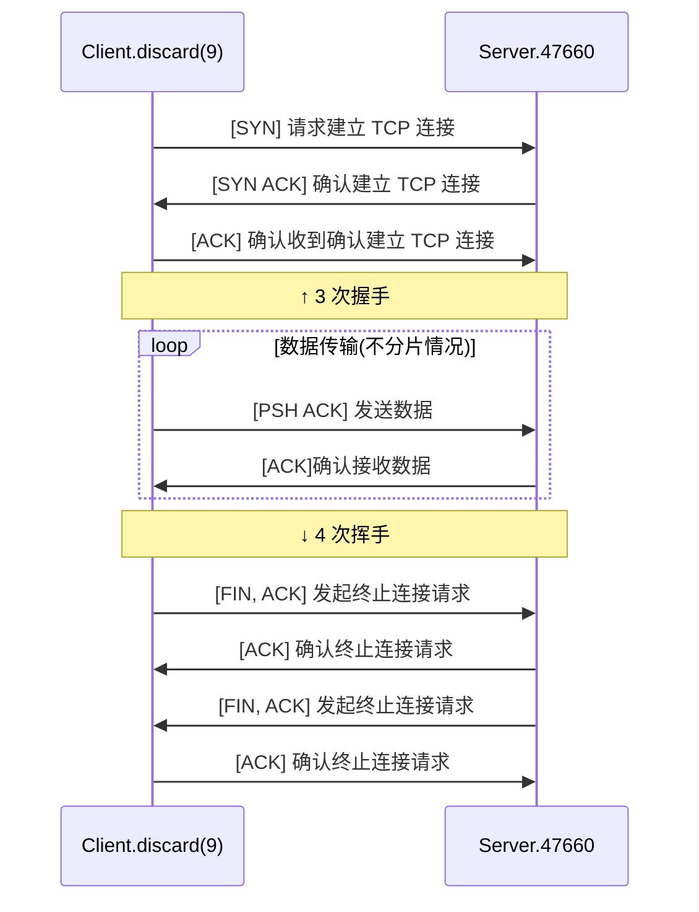

# Mermaid

- [Mermaid](#mermaid)
  - [结点内文字换行](#结点内文字换行)
  - [限制流程图大小](#限制流程图大小)
  - [显示支持](#显示支持)
  - [甘特图](#甘特图)
  - [流程图](#流程图)
    - [流程图整体方向](#流程图整体方向)
    - [结点形状](#结点形状)
    - [连接线形状](#连接线形状)
    - [语法冲突的特殊字符](#语法冲突的特殊字符)
  - [时序图](#时序图)


---

## 结点内文字换行

```
graph LR;
a-->b[2<br>3<br>3]
```



---

## 限制流程图大小

- 绘图时在当前方向上绘制的结点数量及文字比较多那么篇幅会无限扩大, 目前没有找到特别好的限制区域大小的方法
- 不过通常编辑文档时的界面左右大小适应屏幕左右宽度, 上下可以滚动, 那么可以指定 Mermaid 图左右方向绘制以避免图像过长

----

## 显示支持

- VSCode 需要安装扩展-Markdown Preview Mermaid Support 以预览 Mermaid 图像

---

## 甘特图

```
gantt
dateFormat  YYYY-MM-DD
title 甘特图
excludes weekdays 2014-01-10

Completed task  : des1, 2014-01-06,2014-01-08
Active task     : des2, 2014-01-09, 2d
Future task     : des3, after des2, 5d
Future task2    : des4, after des3, 5d
```



---

## 流程图

> [Flowchart (mermaid-js.github.io)](https://mermaid-js.github.io/mermaid/#/flowchart?id=graph)

```
flowchart TD
    Start --> Stop
```




---

> `-->` 实线箭头

---

### 流程图整体方向

- `TB` - top to bottom
- `TD` - top-down/ same as top to bottom
- `BT` - bottom to top
- `RL` - right to left
- `LR` - left to right

---

### 结点形状

> [Flowchart (mermaid-js.github.io)](https://mermaid-js.github.io/mermaid/#/flowchart?id=node-shapes)

```
flowchart LR
  id1(round edges)
  id2([stadium-shaped])
  id3[[subroutine shape]]
  id4[(A node in a cylindrical shape)]
  id5((A node in the form of a circle))
  id6>A node in an asymmetric shape]
  id7{A node rhombus}
  id8{{A hexagon node}}
  id9[/Parallelogram/]
  id10[\Parallelogram alt\]
  id11[/Trapezoid\]
```




---

### 连接线形状

> [Flowchart (mermaid-js.github.io)](https://mermaid-js.github.io/mermaid/#/flowchart?id=links-between-nodes)

```
flowchart LR
  A --> B
  A --实线单箭头--> B
  A -->|实线单箭头|C
  
  B --- C
  B --实线--- C
  B ---|实线|D
  
  C -.-|虚线|D
  C -.->|虚线单箭头|D
  
  D ==> E
  D ==>|粗实线单箭头|E
  
  E --> F & G --> H
  
  H & I --> J & K
  
  L --o|实线圆头|M
  M --x|实线x头|N
  
  N <--> |双向箭头|O
  O o--o P
  P x--x Q
  
  R -------|横线越多越长| S
```




---

### 语法冲突的特殊字符

> [Flowchart (mermaid-js.github.io)](https://mermaid-js.github.io/mermaid/#/flowchart?id=special-characters-that-break-syntax)

```
flowchart LR
  A["结点内使用(括号)"]
```



---

### 子图

`语法`:

```markdown
subgraph title
    graph definition
end
```

`示例`:

```markdown
flowchart TB
    c1-->a2
    subgraph one
    a1-->a2
    end
    subgraph two
    b1-->b2
    end
    subgraph three
    c1-->c2
    end
```



---

## 时序图

> [Sequence diagram (mermaid-js.github.io)](https://mermaid-js.github.io/mermaid/#/sequenceDiagram)
>
> [Mermaid之时序图语法_Feng乍起的博客-CSDN博客_时序图语法](https://blog.csdn.net/qq_37196887/article/details/112764646)

```
sequenceDiagram
participant C as Client.discard(9)
participant S as Server.47660
C ->> S: [SYN] 请求建立 TCP 连接
S ->> C: [SYN ACK] 确认建立 TCP 连接
C ->> S: [ACK] 确认收到确认建立 TCP 连接

Note over C,S: ↑ 3 次握手

loop 数据传输(不分片情况)
C ->> S: [PSH ACK] 发送数据
S ->> C: [ACK]确认接收数据
end

Note over C,S: ↓ 4 次挥手

C ->> S: [FIN, ACK] 发起终止连接请求
S ->> C: [ACK] 确认终止连接请求
S ->> C: [FIN, ACK] 发起终止连接请求
C ->> S: [ACK] 确认终止连接请求
```




