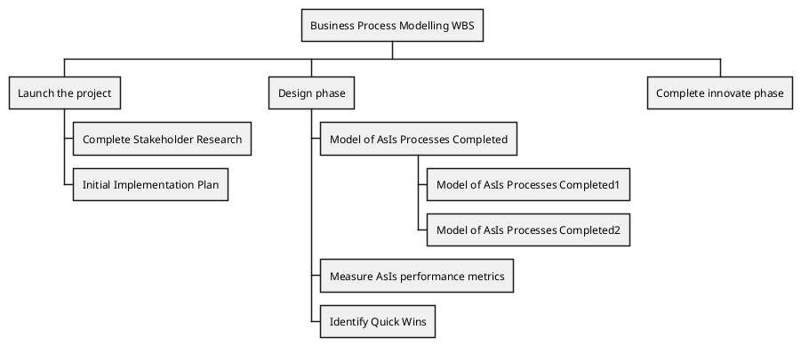

# PlantUML

> [官方中文教程](https://plantuml.com/zh/)

- [PlantUML](#plantuml)
  - [Work Breakdown Structure (WBS)](#work-breakdown-structure-wbs)
  - [OrgMode syntax](#orgmode-syntax)

## Work Breakdown Structure (WBS)

> [工作分解结构](https://wiki.mbalib.com/wiki/%E5%B7%A5%E4%BD%9C%E5%88%86%E8%A7%A3%E7%BB%93%E6%9E%84)
>
> [官方教程](https://plantuml.com/zh/wbs-diagram)
>
> WBS diagram are still in beta: the syntax may change without notice.

---
## OrgMode syntax

- This syntax is compatible with OrgMode

- 基本的 * 的书目代表层级的结构

