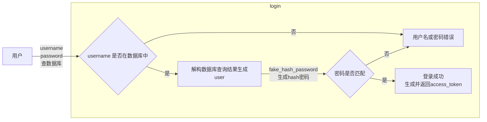
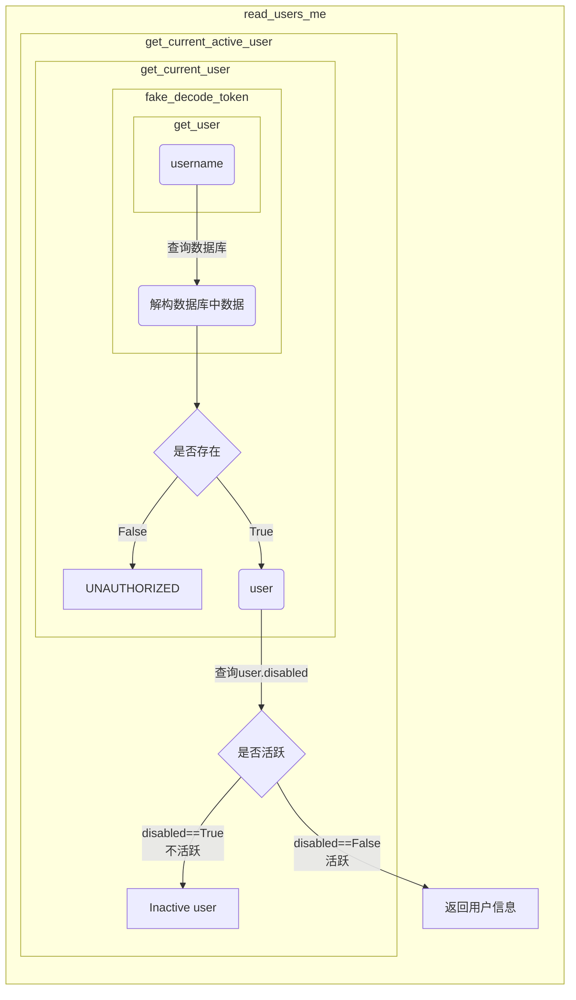

# OAuth2.0 的授权模式

- [OAuth2.0 的授权模式](#oauth20-的授权模式)
  - [密码授权模式(Resource Owner Password Credentials Grant)](#密码授权模式resource-owner-password-credentials-grant)
  - [OAuth2 密码模式和 FastAPI 的 OAuth2PasswordBearer](#oauth2-密码模式和-fastapi-的-oauth2passwordbearer)
  - [基于 Password 和 Bearer token 的 OAuth2 认证](#基于-password-和-bearer-token-的-oauth2-认证)
  - [开发基于 JSON Web Tokens 的认证](#开发基于-json-web-tokens-的认证)

---

- 授权码授权模式(Authorization Code Grant) 
- 隐式授权模式(Implicit Grant) 
- **密码授权模式(Resource Owner Password Credentials Grant) **
- 客户端凭证授权模式(Client Credentials Grant) 

---

## 密码授权模式(Resource Owner Password Credentials Grant)


---

## OAuth2 密码模式和 FastAPI 的 OAuth2PasswordBearer

```python
from fastapi.security import (
    OAuth2PasswordBearer,   # OAuth2的认证方式
)

##### OAuth2 密码模式和 FastAPI 的 OAuth2PasswordBearer #####

"""
OAuth2PasswordBearer是接收URL作为参数的一个类: 
客户端会向该URL发送username和password参数, 然后得到一个Token值
OAuth2PasswordBearer并不会创建相应的URL路径操作, 
只是指明客户端用来请求Token的URL地址
当请求到来的时候, FastAPI会检查请求的Authorization头信息, 
如果没有找到Authorization头信息,或者头信息的内容不是Bearer token,
它会返回401状态码(UNAUTHORIZED)
"""

# 请求Token的URL地址 http://127.0.0.1:8000/chapter06/token
oauth2_schema = OAuth2PasswordBearer(tokenUrl="/chapter06/token")  


@app06.get("/oauth2_password_bearer")
async def oauth2_password_bearer(token: str = Depends(oauth2_schema)):
    return {"token": token}
```

---

## 基于 Password 和 Bearer token 的 OAuth2 认证

```python
##### 基于 Password 和 Bearer token 的 OAuth2 认证 #####

# 模拟数据库信息
fake_users_db = {
    "john snow": {
        "username": "john snow",
        "full_name": "John Snow",
        "email": "johnsnow@example.com",
        "hashed_password": "fakehashedsecret",
        "disabled": False,
    },
    "alice": {
        "username": "alice",
        "full_name": "Alice Wonderson",
        "email": "alice@example.com",
        "hashed_password": "fakehashedsecret2",
        "disabled": True,
    },
}


def fake_hash_password(password: str):
    """对密码进行加密"""
    return "fakehashed" + password


class User(BaseModel):
    """用户信息schema"""
    username: str
    email: Optional[str] = None
    full_name: Optional[str] = None
    disabled: Optional[bool] = None


class UserInDB(User):
    hashed_password: str


@app06.post("/token")
async def login(form_data: OAuth2PasswordRequestForm = Depends()):
    """登录操作
    密码加密使用前缀字符串的形式
    token使用username
    """
    user_dict = fake_users_db.get(form_data.username)
    if not user_dict:
        raise HTTPException(status_code=status.HTTP_400_BAD_REQUEST, detail="Incorrect username or password-用户不存在")
    user = UserInDB(**user_dict)
    hashed_password = fake_hash_password(form_data.password)
    if not hashed_password == user.hashed_password:
        print(hashed_password, user.hashed_password)
        raise HTTPException(status_code=status.HTTP_400_BAD_REQUEST, detail="Incorrect username or password-密码错误")
    return {"access_token": user.username, "token_type": "bearer"}


def get_user(db, username: str):
    """获取用户信息"""
    if username in db:
        user_dict = db[username]
        return UserInDB(**user_dict)


def fake_decode_token(token: str):
    """解码token"""
    user = get_user(fake_users_db, token)
    return user


async def get_current_user(token: str = Depends(oauth2_schema)):
    user = fake_decode_token(token)
    if not user:
        raise HTTPException(
            status_code=status.HTTP_401_UNAUTHORIZED,
            detail="Invalid authentication credentials",
            # OAuth2的规范，如果认证失败，请求头中返回“WWW-Authenticate”
            headers={"WWW-Authenticate": "Bearer"},  
        )
    return user


async def get_current_active_user(current_user: User = Depends(get_current_user)):
    if current_user.disabled:
        raise HTTPException(status_code=status.HTTP_400_BAD_REQUEST, detail="Inactive user")
    return current_user


@app06.get("/users/me")
async def read_users_me(current_user: User = Depends(get_current_active_user)):
    """
    活跃用户返回用户信息  
    不活跃用户返回 Inactive user
    """
    return current_user

```

`login` 执行逻辑:



`read_users_me` 执行逻辑:




---

## 开发基于 JSON Web Tokens 的认证

> [【独家新技术】从0到1学习 FastAPI 框架的所有知识点_哔哩哔哩_bilibili](https://www.bilibili.com/video/BV1iN411X72b?p=32)


```python
# 先更新下模拟数据库吗修改下 hash 密码使其更接近真实值:
fake_users_db.update({
    "john snow": {
        "username": "john snow",
        "full_name": "John Snow",
        "email": "johnsnow@example.com",
        "hashed_password": "$2b$12$EixZaYVK1fsbw1ZfbX3OXePaWxn96p36WQoeG6Lruj3vjPGga31lW",
        "disabled": False,
    }
})
# 生成密钥 openssl rand -hex 32
SECRET_KEY = "09d25e094faa6ca2556c818166b7a9563b93f7099f6f0f4caa6cf63b88e8d3e7"  
# 加密算法
ALGORITHM = "HS256"  
# 访问令牌过期分钟
ACCESS_TOKEN_EXPIRE_MINUTES = 30  
```

```python
# from datetime import (
#     datetime, 
#     timedelta
# )
# from jose import (
#     JWTError, 
#     jwt
# )
# from passlib.context import CryptContext    # 用于对用户传过来的密码进行加密

pwd_context = CryptContext(
    schemes=["bcrypt"],     # 密码加密算法使用 bcrypt
    deprecated="auto"   
)
```

```python
# 用于接收用户名密码, 创建 token 的接口
oauth2_schema = OAuth2PasswordBearer(tokenUrl="/chapter06/jwt/token")


def verity_password(plain_password: str, hashed_password: str):
    """对密码进行校验"""
    return pwd_context.verify(plain_password, hashed_password)


def jwt_get_user(db, username: str):
    """获取当前用户并返回解构信息
    """
    if username in db:
        user_dict = db[username]
        return UserInDB(**user_dict)


def jwt_authenticate_user(db, username: str, password: str):
    """
    验证用户是否存在以及  
    验证用户名和密码是否匹配
    """
    user = jwt_get_user(db=db, username=username)
    if not user:
        return False
    if not verity_password(plain_password=password, hashed_password=user.hashed_password):
        return False
    return user


def create_access_token(data: dict, expires_delta: Optional[timedelta] = None):
    """创建token  
    :param data: 包含用户信息的字典
    :param expires_delta: token 过期时间  
    copy 一份用户信息用户编码

    """
    to_encode = data.copy()
    # 如果传入了过期时间就更新下过期时间: 当前时间+过期时间
    if expires_delta:
        expire = datetime.utcnow() + expires_delta
    else:
        # 没传入过期时间的话默认设置过期时间为 15 min
        expire = datetime.utcnow() + timedelta(minutes=15)
    to_encode.update({"exp": expire})
    # 创建编码后的 jwt
    encoded_jwt = jwt.encode(
        claims=to_encode, 
        key=SECRET_KEY, 
        algorithm=ALGORITHM
    )
    return encoded_jwt


@app06.post("/jwt/token", response_model=Token)
async def login_for_access_token(form_data: OAuth2PasswordRequestForm = Depends()):
    """创建并返回 Token  
    :param form_data: 表单数据
    """
    # jwt 校验
    user = jwt_authenticate_user(db=fake_users_db, username=form_data.username, password=form_data.password)
    # 认证失败则抛出异常: 用户名或密码不正确
    if not user:
        raise HTTPException(
            status.HTTP_401_UNAUTHORIZED,
            detail="Incorrect username or password",
            headers={"WWW-Authenticate": "Bearer"},
        )
    # 获取 token 过期时间
    access_token_expires = timedelta(minutes=ACCESS_TOKEN_EXPIRE_MINUTES)
    # 创建 token
    access_token = create_access_token(
        data={"sub": user.username}, expires_delta=access_token_expires
    )
    return {"access_token": access_token, "token_type": "bearer"}


async def jwt_get_current_user(token: str = Depends(oauth2_schema)):
    """获取当前用户
    :param token: jwt token
    """
    # 定义错误返回信息
    credentials_exception = HTTPException(
        status.HTTP_401_UNAUTHORIZED,
        detail="Could not validate credentials",
        headers={"WWW-Authenticate": "Bearer"},
    )
    try:
        # jwt 解码
        payload = jwt.decode(token=token, key=SECRET_KEY, algorithms=[ALGORITHM])
        # 获取解码后的用户名
        username = payload.get("sub")
        # 如果用户名不存在则抛出异常
        if username is None:
            raise credentials_exception
    # 如果解码失败则抛出异常
    except JWTError:
        raise credentials_exception
    user = jwt_get_user(db=fake_users_db, username=username)
    if user is None:
        raise credentials_exception
    return user


async def jwt_get_current_active_user(current_user: User = Depends(jwt_get_current_user)):
    """获取活跃用户"""
    if current_user.disabled:
        raise HTTPException(status_code=status.HTTP_400_BAD_REQUEST, detail="Inactive user")
    return current_user


@app06.get("/jwt/users/me")
async def jwt_read_users_me(current_user: User = Depends(jwt_get_current_active_user)):
    """获取当前用户信息"""
    return current_user

```


---
