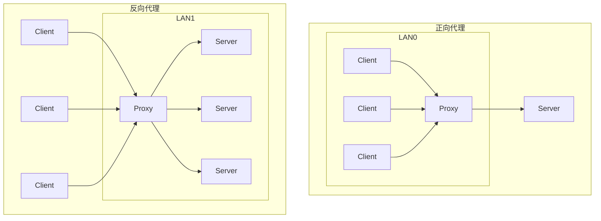
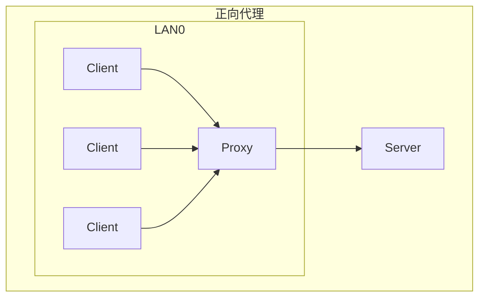
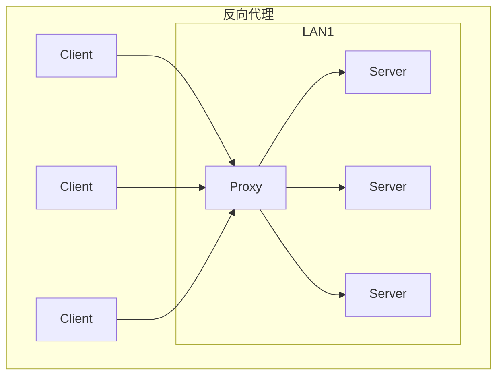

# 代理转发

> [内网渗透之代理转发 - FreeBuf网络安全行业门户](https://www.freebuf.com/articles/web/256415.html)

当拿到一个主机的权限之后可以通过该主机向内网进行渗透, 不过由于该主机上不一定有渗透需要的工具以及若是直接远程连接到主机的话会留下明显的痕迹, 因此通过本地操作然后内网转发流量是比较稳妥的做法

---

## 正向代理与反向代理

- 正向代理中，Proxy和Client同属一个区域，对Server是透明的； 
- 反向代理中，Proxy和Server同属一个区域，对Client透明。

正向代理与反相代理都是用于代替收发请求与响应, 从拓扑上来看大致如下:

---

### 正向代理(Forward Proxy)

Client 为了访问到 Server, 想 Proxy 发送了一个请求并指定目标位 Server, 然后由 Proxy 转发请求并将获得的内容返回给 Client

正向代理，也称为普通代理，是客户端向代理服务器发送请求，代理服务器再将请求发送给目标服务器，然后将目标服务器返回的数据返回给客户端。正向代理的代理对象是客户端, 帮助客户端访问其无法访问的服务器资源

正向代理是代理服务器向服务器发送请求，代表客户端请求数据, 一般是由客户端架设的

正向代理中, 服务器不知道真正的客户端是谁

---

### 反向代理(Reverse Proxy)

反向代理，是客户端向反向代理服务器发送请求，反向代理服务器根据请求的内容将请求转发到内部的服务器集群中的某一台服务器上，将处理结果返回给客户端。反向代理的代理对象是服务器, 帮助服务器做负载均衡, 安全防护等

反向代理是代理服务器接收客户端请求，向服务器发送请求，代表服务器提供服务, 一般是由服务端架设的

反向代理中, 客户端不知道真正的服务器是谁

---

## Socks 协议

代理是一种网络服务, 可以让客户端通过一个中间服务器来访问目标服务器, Socks 协议是一种代理协议, 可以支持任何类型的网络流量

Socks(Socket Secure)协议是一种网络协议，用于在客户端和服务器之间进行通信，常被代理服务器使用。Socks协议与HTTP代理不同，它不解析数据包，而是将其原封不动地发送给代理目标。因此，Socks协议可以更高效地处理网络流量，但也会带来一些安全风险。

Socks 工作在第五层(会话层), 使用 TCP 协议传输数据, 不提供如 ICMP 信息之类的网络层相关服务

Socks 目前有 SOCKS4 和 SOCKS5 两个版本

- SOCKS4支持TELNET, FTP, HTTP等TCP协议；
- SOCKS5支持TCP与UDP，并支持安全认证方案。

> - 认证方式：Socks4 不支持认证机制，而 Socks5 支持多种认证方式，包括用户名密码认证、GSS-API 认证等。
> - 支持的协议：Socks4只支持TCP协议，而Socks5支持TCP和UDP协议。
> - DNS解析：Socks4代理不支持DNS解析，它只接受IP地址作为参数。而Socks5代理支持DNS解析，可以将域名解析为IP地址。
> - Socks5 支持 IPv6, Socks4只支持IPv4地址，而Socks5支持IPv4和IPv6地址。

常见的转发工具有

- reGeorg
- SSH 端口转发
- iptables
- Netsh
- LCX
- EarthWorm(支持多种系统)
- Socks(Linux)
- Netcat

常见的代理链工具:

- Proxychains(Linux)
- Proxifier(Windows)
- Sockscap64(Windows)

---

