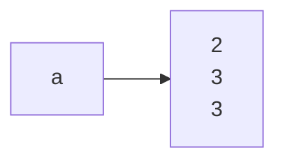

<!--
 * @Author: your name
 * @Date: 2021-06-29 15:40:22
 * @LastEditTime: 2021-06-29 15:57:41
 * @LastEditors: Please set LastEditors
 * @Description: In User Settings Edit
 * @FilePath: \DailyNotes\笔记工具类\Mermaid.md
-->

# 目录
- [目录](#目录)
- [个人调试散点](#个人调试散点)
  - [结点内文字换行](#结点内文字换行)
- [显示支持](#显示支持)

----

# 个人调试散点

---

## 结点内文字换行

---

## 限制流程图大小

- 绘图时在当前方向上绘制的结点数量及文字比较多那么篇幅会无限扩大, 目前没有找到特别好的限制区域大小的方法
- 不过通常编辑文档时的界面左右大小适应屏幕左右宽度, 上下可以滚动, 那么可以指定 Mermaid 图左右方向绘制以避免图像过长

----

# 显示支持

- Github 需要安装[浏览器插件]([GitHub + Mermaid - Chrome 网上应用店 (google.com)](https://chrome.google.com/webstore/detail/github- -mermaid/goiiopgdnkogdbjmncgedmgpoajilohe))以支持显示 Mermaid 图像

- VSCode 需要安装扩展-Markdown Preview Mermaid Support 以预览 Mermaid 图像

----

