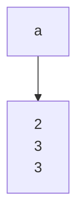

<!--
 * @Author: your name
 * @Date: 2021-06-29 15:40:22
 * @LastEditTime: 2021-06-29 15:43:25
 * @LastEditors: Please set LastEditors
 * @Description: In User Settings Edit
 * @FilePath: \DailyNotes\笔记工具类\Mermaid.md
-->

# 目录
- [目录](#目录)
- [个人调试散点](#个人调试散点)
  - [结点内文字换行](#结点内文字换行)

----

# 个人调试散点

---

## 结点内文字换行

